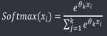
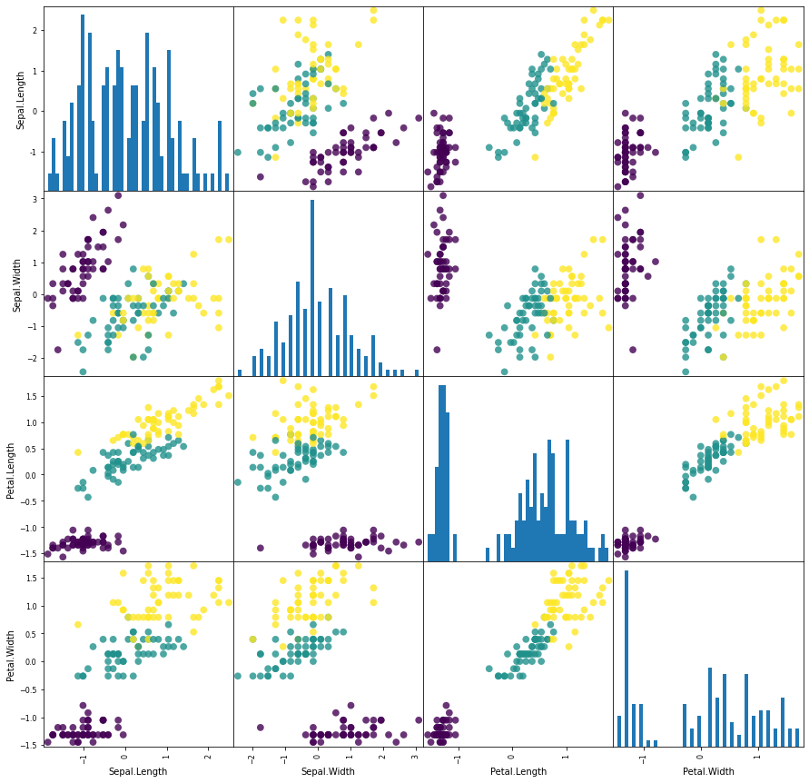

# 实验二 逻辑回归

| 学号 | 20182681 |
| :--: | :------: |
| 姓名 |  黄水清  |
| 班级 | 计科三班 |

## 一、 实验目的

1. 加深对逻辑回归算法的理解和认识。

2. 掌握基于逻辑回归的二分类算法和基于softmax的多分类算法的设计方法。

## 二、实验原理

1. 先拟合决策边界(不局限于线性，还可以是多项式)，再建立这个边界与分类的概率联系，从而得到了二分类情况下的概率。

2.极大似然估计求解的思想和理论依据。

3.逻辑回归的评价指标。

## 三、聚类步骤

1. 读入要分类的数据(数据集：iris_data)，并做一些数据格式的预处理，划分训练集和测试集;

2. 选择对鸢尾花实现多分类，可使用softmax实现;

   **下面开始训练得到模型**

   sklr = LogisticRegression(multi_class='multinomial', solver='sag', C=200, max_iter=1000000)

   **训练集和测试机拆分函数**

   ```python
   X_train, X_test, y_train,y_test = train_test_split(Data[0], Data[1], random_state=10)
   y_train = y_train.ravel()
   y_test = y_test.ravel()
   sklr.fit(X_train, y_train)
   y_predict = sklr.predict(X_test)
   accurcy = np.sum(y_predict == y_test) / len(y_test) # 测试准确率
   print('The accurcy is ',accurcy) 
   ```
```
 

计算实例： https://blog.csdn.net/Air_x/article/details/106290008

 

3.目标函数加上正则项。

4. 利用极大似然估计求解关于未知参数的梯度;参考梯度推导：https://zhuanlan.zhihu.com/p/53312180； 

5.利用梯度下降公式，逐步求解，直至目标函数收敛或者迭代到预设定的运行步数。

6.查阅分类正确与否的指标AUC,并画出对应的结果图。

四、代码和执行结果展示。

 源码：

首先引入机器学习以及数据处理相关的包

​```python

from sklearn.linear_model import LogisticRegression
from sklearn.model_selection import train_test_split
import numpy as np
# import pandas as pd
# import matplotlib.pyplot as plt
# import seaborn as sns
# from sklearn.datasets import load_iris
# import re

def strToData(str):
    if(str == 'setosa'):
        return 0
    elif(str == 'versicolor'):
        return 1
    else:
        return 2

def loadData(filename):
    dataMat = []
    labelMat = []
    ans = []
    res = []
    fr = open(filename)
    labelMat = fr.readline().replace('"', '').strip().split()
    species = labelMat[4]
    labelMat = [labelMat[i] for i in range(0, 4)]
    while True:
        lineArr = fr.readline()
        if not lineArr:
            break
        lineArr = lineArr.strip().split()
        dataMat.append([float(lineArr[i]) for i in range(1, 5)]) # 取前面四个数据集
        ans.append([lineArr[5].replace('"', "")])                # 
        res.append([strToData(str(lineArr[5].replace('"', "")))])
    return dataMat, labelMat, res, species, ans
```


 ## 输出数据印证一下

```python
data, label, res, species, ans = loadData('./iris_data.txt')
print('dataMat-------------------------------------')
print(data)
print('labelMat----------------------------------')
print(label)
print('res------------------------------------')
print(res)
print('species--------------------------------');
print(species)
print('ans------------------------------------')
print(ans)
```

```python
runfile('G:/The_recent_study/大三下学期/机器学习/MachineLearning/first0331/LogisticRegression.py', wdir='G:/The_recent_study/大三下学期/机器学习/MachineLearning/first0331')
dataMat-------------------------------------
[[5.1, 3.5, 1.4, 0.2], [4.9, 3.0, 1.4, 0.2], [4.7, 3.2, 1.3, 0.2], [4.6, 3.1, 1.5, 0.2], [5.0, 3.6, 1.4, 0.2], [5.4, 3.9, 1.7, 0.4], [4.6, 3.4, 1.4, 0.3], [5.0, 3.4, 1.5, 0.2], [4.4, 2.9, 1.4, 0.2], [4.9, 3.1, 1.5, 0.1], [5.4, 3.7, 1.5, 0.2], [4.8, 3.4, 1.6, 0.2], [4.8, 3.0, 1.4, 0.1], [4.3, 3.0, 1.1, 0.1], [5.8, 4.0, 1.2, 0.2], [5.7, 4.4, 1.5, 0.4], [5.4, 3.9, 1.3, 0.4], [5.1, 3.5, 1.4, 0.3], [5.7, 3.8, 1.7, 0.3], [5.1, 3.8, 1.5, 0.3], [5.4, 3.4, 1.7, 0.2], [5.1, 3.7, 1.5, 0.4], [4.6, 3.6, 1.0, 0.2], [5.1, 3.3, 1.7, 0.5], [4.8, 3.4, 1.9, 0.2], [5.0, 3.0, 1.6, 0.2], [5.0, 3.4, 1.6, 0.4], [5.2, 3.5, 1.5, 0.2], [5.2, 3.4, 1.4, 0.2], [4.7, 3.2, 1.6, 0.2], [4.8, 3.1, 1.6, 0.2], [5.4, 3.4, 1.5, 0.4], [5.2, 4.1, 1.5, 0.1], [5.5, 4.2, 1.4, 0.2], [4.9, 3.1, 1.5, 0.2], [5.0, 3.2, 1.2, 0.2], [5.5, 3.5, 1.3, 0.2], [4.9, 3.6, 1.4, 0.1], [4.4, 3.0, 1.3, 0.2], [5.1, 3.4, 1.5, 0.2], [5.0, 3.5, 1.3, 0.3], [4.5, 2.3, 1.3, 0.3], [4.4, 3.2, 1.3, 0.2], [5.0, 3.5, 1.6, 0.6], [5.1, 3.8, 1.9, 0.4], [4.8, 3.0, 1.4, 0.3], [5.1, 3.8, 1.6, 0.2], [4.6, 3.2, 1.4, 0.2], [5.3, 3.7, 1.5, 0.2], [5.0, 3.3, 1.4, 0.2], [7.0, 3.2, 4.7, 1.4], [6.4, 3.2, 4.5, 1.5], [6.9, 3.1, 4.9, 1.5], [5.5, 2.3, 4.0, 1.3], [6.5, 2.8, 4.6, 1.5], [5.7, 2.8, 4.5, 1.3], [6.3, 3.3, 4.7, 1.6], [4.9, 2.4, 3.3, 1.0], [6.6, 2.9, 4.6, 1.3], [5.2, 2.7, 3.9, 1.4], [5.0, 2.0, 3.5, 1.0], [5.9, 3.0, 4.2, 1.5], [6.0, 2.2, 4.0, 1.0], [6.1, 2.9, 4.7, 1.4], [5.6, 2.9, 3.6, 1.3], [6.7, 3.1, 4.4, 1.4], [5.6, 3.0, 4.5, 1.5], [5.8, 2.7, 4.1, 1.0], [6.2, 2.2, 4.5, 1.5], [5.6, 2.5, 3.9, 1.1], [5.9, 3.2, 4.8, 1.8], [6.1, 2.8, 4.0, 1.3], [6.3, 2.5, 4.9, 1.5], [6.1, 2.8, 4.7, 1.2], [6.4, 2.9, 4.3, 1.3], [6.6, 3.0, 4.4, 1.4], [6.8, 2.8, 4.8, 1.4], [6.7, 3.0, 5.0, 1.7], [6.0, 2.9, 4.5, 1.5], [5.7, 2.6, 3.5, 1.0], [5.5, 2.4, 3.8, 1.1], [5.5, 2.4, 3.7, 1.0], [5.8, 2.7, 3.9, 1.2], [6.0, 2.7, 5.1, 1.6], [5.4, 3.0, 4.5, 1.5], [6.0, 3.4, 4.5, 1.6], [6.7, 3.1, 4.7, 1.5], [6.3, 2.3, 4.4, 1.3], [5.6, 3.0, 4.1, 1.3], [5.5, 2.5, 4.0, 1.3], [5.5, 2.6, 4.4, 1.2], [6.1, 3.0, 4.6, 1.4], [5.8, 2.6, 4.0, 1.2], [5.0, 2.3, 3.3, 1.0], [5.6, 2.7, 4.2, 1.3], [5.7, 3.0, 4.2, 1.2], [5.7, 2.9, 4.2, 1.3], [6.2, 2.9, 4.3, 1.3], [5.1, 2.5, 3.0, 1.1], [5.7, 2.8, 4.1, 1.3], [6.3, 3.3, 6.0, 2.5], [5.8, 2.7, 5.1, 1.9], [7.1, 3.0, 5.9, 2.1], [6.3, 2.9, 5.6, 1.8], [6.5, 3.0, 5.8, 2.2], [7.6, 3.0, 6.6, 2.1], [4.9, 2.5, 4.5, 1.7], [7.3, 2.9, 6.3, 1.8], [6.7, 2.5, 5.8, 1.8], [7.2, 3.6, 6.1, 2.5], [6.5, 3.2, 5.1, 2.0], [6.4, 2.7, 5.3, 1.9], [6.8, 3.0, 5.5, 2.1], [5.7, 2.5, 5.0, 2.0], [5.8, 2.8, 5.1, 2.4], [6.4, 3.2, 5.3, 2.3], [6.5, 3.0, 5.5, 1.8], [7.7, 3.8, 6.7, 2.2], [7.7, 2.6, 6.9, 2.3], [6.0, 2.2, 5.0, 1.5], [6.9, 3.2, 5.7, 2.3], [5.6, 2.8, 4.9, 2.0], [7.7, 2.8, 6.7, 2.0], [6.3, 2.7, 4.9, 1.8], [6.7, 3.3, 5.7, 2.1], [7.2, 3.2, 6.0, 1.8], [6.2, 2.8, 4.8, 1.8], [6.1, 3.0, 4.9, 1.8], [6.4, 2.8, 5.6, 2.1], [7.2, 3.0, 5.8, 1.6], [7.4, 2.8, 6.1, 1.9], [7.9, 3.8, 6.4, 2.0], [6.4, 2.8, 5.6, 2.2], [6.3, 2.8, 5.1, 1.5], [6.1, 2.6, 5.6, 1.4], [7.7, 3.0, 6.1, 2.3], [6.3, 3.4, 5.6, 2.4], [6.4, 3.1, 5.5, 1.8], [6.0, 3.0, 4.8, 1.8], [6.9, 3.1, 5.4, 2.1], [6.7, 3.1, 5.6, 2.4], [6.9, 3.1, 5.1, 2.3], [5.8, 2.7, 5.1, 1.9], [6.8, 3.2, 5.9, 2.3], [6.7, 3.3, 5.7, 2.5], [6.7, 3.0, 5.2, 2.3], [6.3, 2.5, 5.0, 1.9], [6.5, 3.0, 5.2, 2.0], [6.2, 3.4, 5.4, 2.3], [5.9, 3.0, 5.1, 1.8]]
labelMat----------------------------------
['Sepal.Length', 'Sepal.Width', 'Petal.Length', 'Petal.Width']
res------------------------------------
[[0], [0], [0], [0], [0], [0], [0], [0], [0], [0], [0], [0], [0], [0], [0], [0], [0], [0], [0], [0], [0], [0], [0], [0], [0], [0], [0], [0], [0], [0], [0], [0], [0], [0], [0], [0], [0], [0], [0], [0], [0], [0], [0], [0], [0], [0], [0], [0], [0], [0], [1], [1], [1], [1], [1], [1], [1], [1], [1], [1], [1], [1], [1], [1], [1], [1], [1], [1], [1], [1], [1], [1], [1], [1], [1], [1], [1], [1], [1], [1], [1], [1], [1], [1], [1], [1], [1], [1], [1], [1], [1], [1], [1], [1], [1], [1], [1], [1], [1], [1], [2], [2], [2], [2], [2], [2], [2], [2], [2], [2], [2], [2], [2], [2], [2], [2], [2], [2], [2], [2], [2], [2], [2], [2], [2], [2], [2], [2], [2], [2], [2], [2], [2], [2], [2], [2], [2], [2], [2], [2], [2], [2], [2], [2], [2], [2], [2], [2], [2], [2]]
species--------------------------------
Species
ans------------------------------------
[['setosa'], ['setosa'], ['setosa'], ['setosa'], ['setosa'], ['setosa'], ['setosa'], ['setosa'], ['setosa'], ['setosa'], ['setosa'], ['setosa'], ['setosa'], ['setosa'], ['setosa'], ['setosa'], ['setosa'], ['setosa'], ['setosa'], ['setosa'], ['setosa'], ['setosa'], ['setosa'], ['setosa'], ['setosa'], ['setosa'], ['setosa'], ['setosa'], ['setosa'], ['setosa'], ['setosa'], ['setosa'], ['setosa'], ['setosa'], ['setosa'], ['setosa'], ['setosa'], ['setosa'], ['setosa'], ['setosa'], ['setosa'], ['setosa'], ['setosa'], ['setosa'], ['setosa'], ['setosa'], ['setosa'], ['setosa'], ['setosa'], ['setosa'], ['versicolor'], ['versicolor'], ['versicolor'], ['versicolor'], ['versicolor'], ['versicolor'], ['versicolor'], ['versicolor'], ['versicolor'], ['versicolor'], ['versicolor'], ['versicolor'], ['versicolor'], ['versicolor'], ['versicolor'], ['versicolor'], ['versicolor'], ['versicolor'], ['versicolor'], ['versicolor'], ['versicolor'], ['versicolor'], ['versicolor'], ['versicolor'], ['versicolor'], ['versicolor'], ['versicolor'], ['versicolor'], ['versicolor'], ['versicolor'], ['versicolor'], ['versicolor'], ['versicolor'], ['versicolor'], ['versicolor'], ['versicolor'], ['versicolor'], ['versicolor'], ['versicolor'], ['versicolor'], ['versicolor'], ['versicolor'], ['versicolor'], ['versicolor'], ['versicolor'], ['versicolor'], ['versicolor'], ['versicolor'], ['versicolor'], ['versicolor'], ['virginica'], ['virginica'], ['virginica'], ['virginica'], ['virginica'], ['virginica'], ['virginica'], ['virginica'], ['virginica'], ['virginica'], ['virginica'], ['virginica'], ['virginica'], ['virginica'], ['virginica'], ['virginica'], ['virginica'], ['virginica'], ['virginica'], ['virginica'], ['virginica'], ['virginica'], ['virginica'], ['virginica'], ['virginica'], ['virginica'], ['virginica'], ['virginica'], ['virginica'], ['virginica'], ['virginica'], ['virginica'], ['virginica'], ['virginica'], ['virginica'], ['virginica'], ['virginica'], ['virginica'], ['virginica'], ['virginica'], ['virginica'], ['virginica'], ['virginica'], ['virginica'], ['virginica'], ['virginica'], ['virginica'], ['virginica'], ['virginica'], ['virginica']]
```


## 下面是利用pandas的画图库对数据进行可视化分析

```python
import pandas as pd

iris_dataframe = pd.DataFrame(X_DATA, columns = label)
pd.plotting.scatter_matrix(iris_dataframe, c=Y_DATA, figsize=(15,15), 
                           marker='0', hist_kwds={'bins':50},s=60,
                           alpha=.8)
```




## 下面对数据进行标准化
X = np.array(data)
Y = np.array(res)
XData = (X - np.mean(X, axis=0)) / np.std(X, axis = 0) # 标准化

##  打乱数据

XYData = np.hstack((XData, Y))
np.random.shuffle(XYData) #  打乱数据

X_DATA = XYData[:, :4]
Y_DATA = XYData[:, 4:]
Data = [X_DATA, Y_DATA]
print('Data:/n',Y_DATA)

## 下面开始训练得到模型

sklr = LogisticRegression(multi_class='multinomial', solver='sag', C=200, max_iter=1000000)

### 训练集和测试机拆分函数

X_train, X_test, y_train,y_test = train_test_split(Data[0], Data[1], random_state=10)
y_train = y_train.ravel()
y_test = y_test.ravel()
sklr.fit(X_train, y_train)
y_predict = sklr.predict(X_test)
accurcy = np.sum(y_predict == y_test) / len(y_test) # 测试准确率
print('The accurcy is ',accurcy)

将得到模型去测试我们预留的25%的测试集去对模型进行测试，经过反复测试，准确率高达90%以上

```python
The accurcy is  0.9736842105263158
The accurcy is  1.0
The accurcy is  0.8947368421052632
The accurcy is  0.9210526315789473
The accurcy is  0.9473684210526315
The accurcy is  0.9473684210526315
The accurcy is  0.9473684210526315
The accurcy is  0.9736842105263158
The accurcy is  0.9736842105263158
The accurcy is  0.9736842105263158
```

