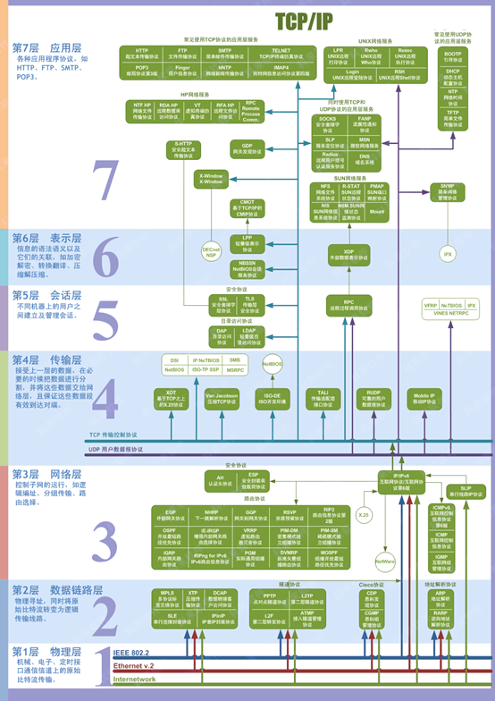
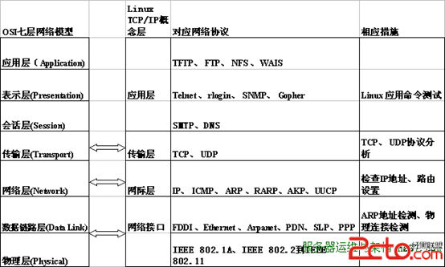
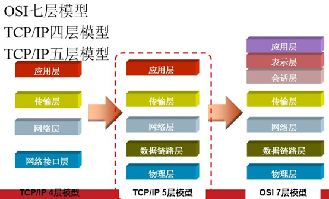
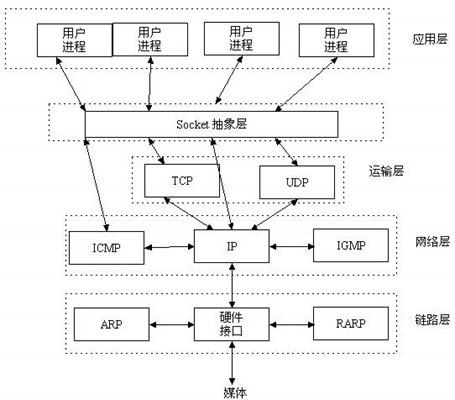
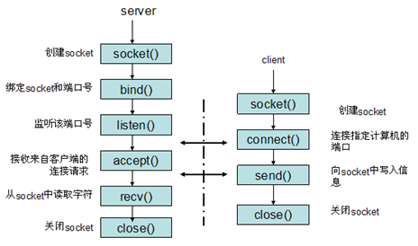
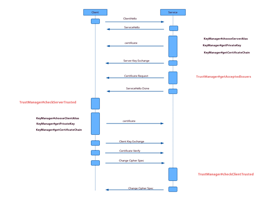

# 1   各层的位置

## 1.1   OSI七层模型全景图

 

 

OSI是Open System Interconnect的缩写，意为开放式系统互联。

 

## 1.2   五层网络协议

在七层的基础上，删除了说不清楚的会话层和表示层，合并到了应用层。

 

 

 

## 1.3   TCP/IP四层参考模型

不关心底层，在五层的基础上，去掉了物理层。然后去掉了其他层与TCP/IP无关的部分

 

 

## 1.4   常用协议所属层

如上图所示：

应用层：用用程序协议

TCP类：HTTP,FTP,SMTP,TELNET,POP3…

TCP+UDP类：SOCKS,SLP,DNS,MSN,NFS

​    UDP：NTP,SNMP,

表示层：语法语义。如加解密，翻译，(解)压缩。

会话层：会话管理。

​    TCP类：SSL,TLS,DAP,LDAP

UDP+UDP类：RPC

------------以上在五层协议里统称会话层。

 

传输层：TCP UDP

网络层：IP ICMP 以及路由相关协议

链路层：交换机协议 ARP RARP

 

 

# 2   TCP

## 2.1   TCP简介

 TCP（Transmission Control Protocol 传输控制协议）是一种面向连接的、可靠的、基于字节流的传输层通信协议，由IETF的RFC 793定义。

## 2.2   TCP特征

提供的是面向连接、可靠的字节流服务。

当客户和服务器彼此交换数据前，必须先在双方之间建立一个TCP连接，之后才能传输数据。TCP提供超时重发，丢弃重复数据，检验数据，流量控制等功能，保证数据能从一端传到另一端。

 

## 2.3   优缺点

优点：安全、传输数据无大小限制、准确可靠，先发先至

缺点：效率低，不能做离线任务、连接有耗时

## 2.4   TCP三次握手过程

第一次握手：客户端尝试连接服务器，向服务器发送syn包（同步序列编号Synchronize Sequence Numbers）， syn=j，客户端进入SYN_SEND状态等待服务器确认

 

第二次握手：服务器接收客户端syn包并确认（ack=j+1），同时向客户端发送一个SYN包（syn=k），即SYN+ACK包， 此时服务器进入SYN_RECV状态

 

第三次握手：第三次握手：客户端收到服务器的SYN+ACK包，向服务器发送确认包ACK(ack=k+1），此包发送完毕， 客户端和服务器进入ESTABLISHED状态，完成三次握手

## 2.5   TCP四次挥手过程

第一次挥手：Client发送一个FIN，用来关闭Client到Server的数据传送，Client进入FIN_WAIT_1状态。

 

第二次挥手：Server收到FIN后，发送一个ACK给Client，确认序号为收到序号+1（与SYN相同，一个FIN占用一个序号），Server进入CLOSE_WAIT状态。

 

第三次挥手：Server发送一个FIN，用来关闭Server到Client的数据传送，Server进入LAST_ACK状态。

 

第四次挥手：Client收到FIN后，Client进入TIME_WAIT状态，接着发送一个ACK给Server，确认序号为收到序号+1， Server进入CLOSED状态，完成四次挥手。

 

# 3   UDP

## 3.1   UDP简介

UDP 是User Datagram Protocol的简称， 中文名是用户数据报协议，是OSI（Open System Interconnection，开放式系统互联） 参考模型中一种无连接的传输层协议，提供面向事务的简单不可靠信息传送服务，IETF RFC 768是UDP的正式规范。UDP在IP报文的协议号是17。

 

## 3.2   UDP特征

（1）  UDP是一个[无连接协议](https://baike.baidu.com/item/无连接协议)，传输数据之前源端和终端不建立连接，当它想传送时就简单地去抓取来自应用程序的数据，并尽可能快地把它扔到网络上。在发送端，UDP传送数据的速度仅仅是受应用程序生成数据的速度、计算机的能力和传输带宽的限制；在接收端，UDP把每个消息段放在队列中，应用程序每次从队列中读一个消息段。

（2）    由于传输数据不建立连接，因此也就不需要维护连接状态，包括收发状态等，因此一台服务机可同时向多个客户机传输相同的消息。

（3）    不可靠传输协议。

（4）    吞吐量不受拥挤控制算法的调节，只受应用软件生成数据的速率、传输带宽、源端和终端主机性能的限制。

（5）    UDP使用尽最大努力交付，即不保证可靠交付，因此主机不需要维持复杂的链接状态表（这里面有许多参数）。

（6）    UDP是面向报文的。发送方的UDP对应用程序交下来的报文，在添加首部后就向下交付给IP层。既不拆分，也不合并，而是保留这些报文的边界，因此，应用程序需要选择合适的报文大小。

## 3.3   优缺点

优点：可以传输大文件，速度快，效率高

缺点：不安全，容易丢包（数据）、先发未必先至

## 3.4   适合场景

当一个消息丢失后，不久就会有一个新消息替代他的场景。

 

# 4   Socket

## 4.1   Socket解决的问题

TCP/IP只是个协议，这个协议最终要通过一个抽象接口实现，这个接口，就是Socket。

 

在设计模式中，Socket接口其实就是一个门面模式，它把复杂的TCP/IP协议族隐藏在Socket接口后面，对用户来说，一组简单的接口就是全部，让Socket接口去组织数据，以符合指定的协议。

 

Socket接口用于创建并唯一标识一个网络通信链路。

 

Socket接口创建出来的东西就是socket，然后进程可以利用socket进行通信。

 

所以，一个Sokcet需要包含五元组信息：连接使用的协议，本地主机的IP地址，本地进程的协议端口，远地主机的IP地址，远地进程的协议端口。

 

 

 

 

## 4.2   通信流程

 

 

 

## 4.3   支持的传输协议

TCP传输协议、UDP传输协议、STCP传输协议、TIPC传输协议。

 

 

# 5   HTTP

## 5.1   HTTP简介

HTTP协议是Hyper Text Transfer Protocol（超文本传输协议）的缩写,是用于从万维网（WWW:World Wide Web ）服务器传输超文本到本地浏览器的传送协议。

 

HTTP是一个基于TCP/IP通信协议来传递数据

 

## 5.2   HTTP的主要特点

1、 简单快速：客户向服务器请求服务时，只需传送请求方法和路径。由于HTTP协议简单，使得HTTP服务器的程序规模小，因而通信速度很快。

2、 灵活：HTTP允许传输任意类型的数据对象。正在传输的类型由Content-Type加以标记。

3、 无连接：无连接的含义是限制每次连接只处理一个请求。服务器处理完客户的请求，并收到客户的应答后，即断开连接。采用这种方式可以节省传输时间。

4、 无状态：HTTP协议是无状态协议。无状态是指协议对于事务处理没有记忆能力。缺少状态意味着如果后续处理需要前面的信息，则它必须重传，这样可能导致每次连接传送的数据量增大。另一方面，在服务器不需要先前信息时它的应答就较快。

5、 支持B/S及C/S模式。

 

### 5.2.1    无连接、无状态的理解

TCP协议对应于传输层，而HTTP协议对应于应用层，从本质上来说，二者没有可比性。Http协议是建立在TCP协议基础之上的，当浏览器需要从服务器获取网页数据的时候，会发出一次Http请求。Http会通过TCP建立起一个到服务器的连接通道，当本次请求的数据完毕后，Http会立即将TCP连接断开，这个过程是很短的。所以Http连接是一种短连接，是一种无状态的连接。所谓的无状态，是指浏览器每次向服务器发起请求的时候，不是通过一个连接，而是每次都建立一个新的连接。如果是一个连接的话，服务器进程中就能保持住这个连接并且在内存中记住一些信息状态。而每次请求结束后，连接就关闭，相关的内容就释放了，所以记不住任何状态，成为无状态连接。

 

 

### 5.2.2    KeepAlive机制

HTTP 对 TCP 连接的使用，分为两种方式：俗称“短连接”和“长连接”（“长连接”又称“持久连接”，洋文叫做“Keep-Alive”或“Persistent Connection”）

 

假设有一个网页，里面包含好多图片，还包含好多【外部的】CSS 文件和 JS 文件。在“短连接”的模式下，浏览器会先发起一个 TCP 连接，拿到该网页的 HTML 源代码（拿到 HTML 之后，这个 TCP 连接就关闭了）。然后，浏览器开始分析这个网页的源码，知道这个页面包含很多外部资源（图片、CSS、JS）。然后针对【每一个】外部资源，再分别发起一个个 TCP 连接，把这些文件获取到本地（同样的，每抓取一个外部资源后，相应的 TCP 就断开）

相反，如果是“长连接”的方式，浏览器也会先发起一个 TCP 连接去抓取页面。但是抓取页面之后，该 TCP 连接并不会立即关闭，而是暂时先保持着（所谓的“Keep-Alive”）。然后浏览器分析 HTML 源码之后，发现有很多外部资源，就用刚才那个 TCP 连接去抓取此页面的外部资源。

 

在 HTTP 1.0 版本，【默认】使用的是“短连接”（那时候是 Web 诞生初期，网页相对简单，“短连接”的问题不大）；

到了1995年底开始制定 HTTP 1.1 草案的时候，网页已经开始变得复杂（网页内的图片、脚本越来越多了）。这时候再用短连接的方式，效率太低下了（因为建立 TCP 连接是有“时间成本”和“CPU 成本”滴）。所以，在 HTTP 1.1 中，【默认】采用的是“Keep-Alive”的方式。

 

### 5.2.3    HTTP为啥不选择UDP

主要原因是要保证可靠传输。

 

## 5.3   HTTP的请求方法

HTTP1.0定义了三种请求方法： GET, POST 和 HEAD方法。

HTTP1.1新增了五种请求方法：OPTIONS, PUT, DELETE, TRACE 和 CONNECT 方法。

 

GET   请求指定的页面信息，并返回实体主体。

HEAD   类似于get请求，只不过返回的响应中没有具体的内容，用于获取报头

POST   向指定资源提交数据进行处理请求（例如提交表单或者上传文件）。数据被包含在请求体中。POST请求可能会导致新的资源的建立和/或已有资源的修改。

PUT   从客户端向服务器传送的数据取代指定的文档的内容。

DELETE   请求服务器删除指定的页面。

CONNECT   HTTP/1.1协议中预留给能够将连接改为管道方式的代理服务器。

OPTIONS   允许客户端查看服务器的性能。

TRACE   回显服务器收到的请求，主要用于测试或诊断。

 

## 5.4   HTTP请求/响应步骤

1、客户端连接到Web服务器

 一个HTTP客户端，通常是浏览器，与Web服务器的HTTP端口（默认为80）建立一个TCP套接字连接。

2、发送HTTP请求

 通过TCP套接字，客户端向Web服务器发送一个文本的请求报文，一个请求报文由请求行、请求头部、空行和请求数据四部分组成。

3、服务器接受请求并返回HTTP响应

 Web服务器解析请求，定位请求资源。服务器将资源复本写到TCP套接字，由客户端读取。一个响应由状态行、响应头部、空行和响应数据4部分组成。

4、释放连接[TCP连接]

 若connection 模式为close，则服务器主动关闭[TCP连接]

 客户端被动关闭连接，释放[TCP连接]若connection 模式为keepalive，则该连接会保持一段时间，在该时间内可以继续接收请求;

5、客户端浏览器解析HTML内容

 客户端浏览器首先解析状态行，查看表明请求是否成功的状态代码。然后解析每一个响应头，响应头告知以下为若干字节的HTML文档和文档的字符集。客户端浏览器读取响应数据HTML，根据HTML的语法对其进行格式化，并在浏览器窗口中显示。

 

 

# 6   HTTPS、TLS、SSL

## 6.1   SSL/TLS是啥

SSL 是洋文“Secure Sockets Layer”的缩写，中文叫做“安全套接层”。它是在上世纪90年代中期，由网景公司设计的。（顺便插一句，网景公司不光发明了 SSL，还发明了很多 Web 的基础设施——比如“CSS 样式表”和“JS 脚本”）

为啥要发明 SSL 这个协议捏？因为原先互联网上使用的 HTTP 协议是明文的，存在很多缺点——比如传输内容会被偷窥（嗅探）和篡改。发明 SSL 协议，就是为了解决这些问题。

到了1999年，SSL 因为应用广泛，已经成为互联网上的事实标准。IETF 就在那年把 SSL 标准化。标准化之后的名称改为 TLS（是“Transport Layer Security”的缩写），中文叫做“传输层安全协议”。

很多相关的文章都把这两者并列称呼（SSL/TLS），因为这两者可以视作同一个东西的不同阶段。

SSL是一个通用协议，不止可以支持HTTPS，还能支持其他各种协议：比如：FTP、SMTP、POP、Telnet

## 6.2   “HTTPS”是啥意思

HTTPS 协议，说白了就是“HTTP 协议”和“SSL/TLS 协议”的组合。你可以把 HTTPS 大致理解为——“HTTP over SSL”或“HTTP over TLS”（反正 SSL 和 TLS 差不多）。

## 6.3   HTTPS所拥有的特征

### 6.3.1    保密性（防泄密）

HTTPS 需要做到足够好的保密性。

说到保密性，首先要能够对抗嗅探（行话叫 Sniffer）。所谓的“嗅探”，通俗而言就是监视你的网络传输流量。如果你使用明文的 HTTP 上网，那么监视者通过嗅探，就知道你在访问哪些网站的哪些页面。

嗅探是最低级的攻击手法。除了嗅探，HTTPS 还需要能对抗其它一些稍微高级的攻击手法——比如“重放攻击”（后面讲协议原理的时候，会再聊）。

### 6.3.2    完整性（防篡改）

除了“保密性”，还有一个同样重要的目标是“确保完整性”。关于“完整性”这个概念，在之前的博文《扫盲文件完整性校验——关于散列值和数字签名》中大致提过。健忘的同学再去温习一下。

在发明 HTTPS 之前，由于 HTTP 是明文的，不但容易被嗅探，还容易被篡改。

举个例子：

比如咱们天朝的网络运营商（ISP）都比较流氓，经常有网友抱怨说访问某网站（本来是没有广告的），竟然会跳出很多中国电信的广告。为啥会这样捏？因为你的网络流量需要经过 ISP 的线路才能到达公网。如果你使用的是明文的 HTTP，ISP 很容易就可以在你访问的页面中植入广告。

所以，当初设计 HTTPS 的时候，还有一个需求是“确保 HTTP 协议的内容不被篡改”。

### 6.3.3    真实性（防假冒）

在谈到 HTTPS 的需求时，“真实性”经常被忽略。其实“真实性”的重要程度不亚于前面的“保密性”和“完整性”。

举个例子：

你因为使用网银，需要访问该网银的 Web 站点。那么，你如何确保你访问的网站确实是你想访问的网站？（这话有点绕口令）

有些天真的同学会说：通过看网址里面的域名，来确保。为啥说这样的同学是“天真的”？因为 DNS 系统本身是不可靠的（尤其是在设计 SSL 的那个年代，连 DNSSEC 都还没发明）。由于 DNS 的不可靠（存在“域名欺骗”和“域名劫持”），你看到的网址里面的域名【未必】是真实滴！

（不了解“域名欺骗”和“域名劫持”的同学，可以参见俺之前写的《扫盲 DNS 原理，兼谈“域名劫持”和“域名欺骗/域名污染”》）

所以，HTTPS 协议必须有某种机制来确保“真实性”的需求（至于如何确保，后面会细聊）。

## 6.4   HTTPS建链流程

 

 

1、 客户端发起一个https的请求，把自身支持的一系列Cipher Suite（密钥算法套件，简称Cipher）发送给服务端 ClientHello

2、 服务端接收到客户端所有的Cipher后与自身支持的对比，如果不支持则连接断开，反之则会从中选出一种加密算法和HASH算法，以证书的形式返回给客户端。ServerHello Certificate ServerHelloDone

3、 客户端收到服务端响应的证书后. client_key_exchange+change_cipher_spec+encrypted_handshake_message

- 第一步、校验证书的是否有效。关于客户端校验证书的是否有效已经做了详细的介绍，这里就不赘述了。
- 第二步、生成随机密码。如果证书验证通过，或者用户接受了不授信的证书，此时浏览器会生成一串随机密码，然后用证书中的公钥加密。
- 第三步、用最开始约定好的HASH方式，把握手消息取HASH值，把用 随机数密码加密 “握手消息+握手消息HASH值(签名)”和用公钥加密的随机密码 一起发送给服务端。把握手消息做一个签名，用于验证握手消息在传输过程中没有被篡改过。

4、服务端拿到客户端传来的密文，用自己的私钥来解密，获取随机密码，再用随机数密码 解密 握手消息与HASH值，并与传过来的HASH值做对比确认是否一致。然后用随机密码加密一段握手消息(握手消息+握手消息的HASH值 )给客户端。（此时服务器端已经获取到了客户端生成的随机密码了） 服务端用随机密码解密并计算握手消息的HASH，如果与客户端发来的HASH一致，此时握手过程结束。
change_cipher_spec+encrypted_handshake_message

 

# 7   WebSocket

## 7.1   来龙去脉

WebSocket出现之前，Web端为了实现即时通讯，所用的技术都是Ajax轮询(polling)。轮询是在特定的的时间间隔（如每1秒），由浏览器对服务器发出HTTP request，然后由服务器返回最新的数据给客服端的浏览器。这种传统的HTTP request 的模式带来很明显的缺点 – 浏览器需要不断的向服务器发出请求，然而HTTP request 的header是非常长的，里面包含的数据可能只是一个很小的值，这样会占用很多的带宽。

 

从特征来看，webSocket摒弃了HTTP的如下特征：无状态、无连接、单向。

变成了一个双向全双工的长连接。

 

## 7.2   技术本质

Websocket分两部分：

1、 会话初始协议：采用的是HTTP协议，并添加了一些新的头域。

2、 会话交互协议：这也是一个新的名为Websocket的应用层协议。

a)   WS的连接不能通过中间人来转发，它必须是一个直接连接；

b)   WS连接建立之后，通信双方都可以在任何时刻向另一方发送数据；

c)   WS连接建立之后，数据的传输使用帧来传递，不再需要Request消息；

d)   WS的数据帧有序。

 

## 7.3   与socket对比

Websocket是一个新的应用层协议，而socket的一个对传输层协议TCP/UDP等的接口封装。

所以，WebSokcet和Socket不是一个可以水平对比的东西。

WebSocket的底层实现，可以采用socket接口。

 

## 7.4   加密

wss 建立在HTTPS 的基础上，在握手的时候使用HTTS 建立连接。

以上是建链消息加密

传输内容加密，网上没找到具体的资料，应该也是基于tls的socket加密，而tls的证书交换，前面HTTPS链接的时候，已经完成。

# 8   后WebSocket协议

## 8.1   STOMP

STOMP是WebSocket的子协议（更高层），WebSocket定义了两种消息类型，text和binary，但是没有定义消息内容。STOMP为客户端和服务端定义了一种机制，包括两者分别可以发送消息的类型，消息格式和消息内容等。

 

 

 

# 9   参考

OSI七层模型详解

https://blog.csdn.net/u014082714/article/details/44994719

聊聊HTTPS和SSL/TLS协议

http://www.techug.com/post/https-ssl-tls.html

 

- 《[WebSocket详解（一）：初步认识WebSocket技术](https://link.juejin.im/?target=http%3A%2F%2Fwww.52im.net%2Fthread-331-1-1.html)》
- 《[WebSocket详解（二）：技术原理、代码演示和应用案例](https://link.juejin.im/?target=http%3A%2F%2Fwww.52im.net%2Fthread-326-1-1.html)》
- 《[WebSocket详解（三）：深入WebSocket通信协议细节](https://link.juejin.im/?target=http%3A%2F%2Fwww.52im.net%2Fthread-332-1-1.html)》
- 《[WebSocket详解（四）：刨根问底HTTP与WebSocket的关系(上篇)](https://link.juejin.im/?target=http%3A%2F%2Fwww.52im.net%2Fthread-1258-1-1.html)》
- 《[WebSocket详解（五）：刨根问底HTTP与WebSocket的关系(下篇)](https://link.juejin.im/?target=http%3A%2F%2Fwww.52im.net%2Fthread-1266-1-1.html)》
- 《[WebSocket详解（六）：刨根问底WebSocket与Socket的关系](https://link.juejin.im/?target=http%3A%2F%2Fwww.52im.net%2Fthread-1266-1-1.html)》（ 本文）
- 《WebSocket详解（七）：WebSocket协议与Socket.io开源工程》