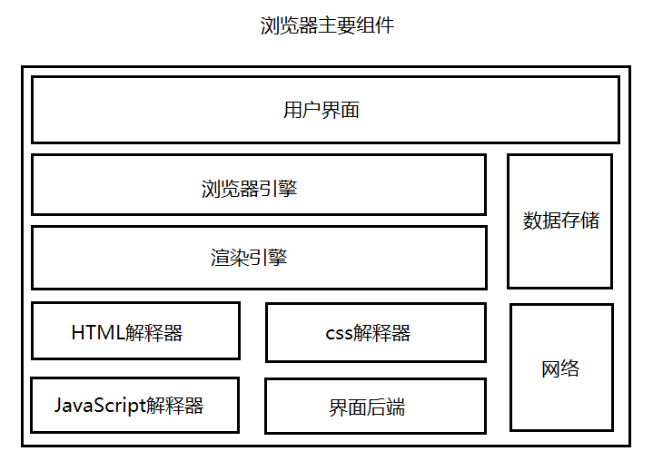

# 浏览器主要结构]

 

**用户界面**：包括地址栏，前进/后退/刷新等按钮、页面主窗口等。

**浏览器引擎**：负责将用户的操作传递给对应的渲染引擎。

**渲染引擎**：能够调用解释器解释HTML、css、JavaScript代码，然后根据解释结果重排页面并绘制DOM树。

**HTML解释器**：解释HTML代码。

**css解释器**：解释css代码。

**JavaScript解释器**：解释js代码。

**界面后端**：绘制组合框和窗口等基本组件。

**数据存储**：在本地存储一些体积较小的数据，如cookie、session对象等。

**网络**：自动加载HTML文档中所需的其他资源。

HTML、js、css代码都需要解释器才能运行。浏览器之所以能将HTML文本变成丰富的网页，就是内置的解释器的原因，否则这些代码只能作为文本出现。

