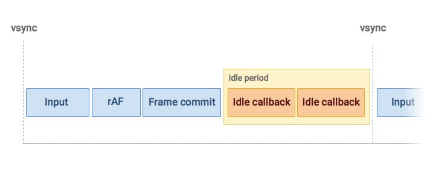
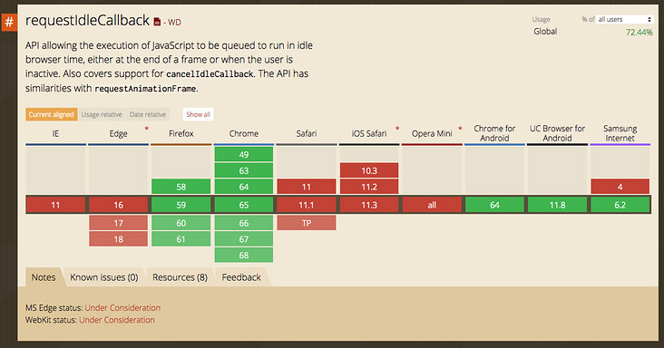

我们都知道React 16实现了新的调度策略(Fiber), 新的调度策略提到的异步、可中断，其实就是基于浏览器的 requestIdleCallback和requestAnimationFrame两个API。所以这里我们有必要了解一下这两个API，关于Fiber部分后面会单开几篇讲。

### 什么是requestIdleCallback?

> 先看看MDN解读

**`window.requestIdleCallback()`**方法将在浏览器的空闲时段内调用的函数排队。这使开发者能够在主事件循环上执行后台和低优先级工作，而不会影响延迟关键事件，如动画和输入响应。函数一般会按先进先调用的顺序执行，然而，如果回调函数指定了执行超时时间`timeout`，则有可能为了在超时前执行函数而打乱执行顺序。

你可以在空闲回调函数中调用`**requestIdleCallback()**`，以便在下一次通过事件循环之前调度另一个回调。

强烈建议使用`timeout`选项进行必要的工作，否则可能会在触发回调之前经过几秒钟。


当关注用户体验，不希望因为一些不重要的任务（如统计上报）导致用户感觉到卡顿的话，就应该考虑使用requestIdleCallback。因为requestIdleCallback回调的执行的前提条件是当前浏览器处于空闲状态。

> requestIdleCallback will schedule work when there is free time at the end of a frame, or when the user is inactive.

requestIdleCallback用法示例

```
    requestIdleCallback(myNonEssentialWork);
    
    
    function myNonEssentialWork (deadline) {
    
      // deadline.timeRemaining()可以获取到当前帧剩余时间
      while (deadline.timeRemaining() > 0 && tasks.length > 0) {
        doWorkIfNeeded();
      }
      if (tasks.length > 0){
        requestIdleCallback(myNonEssentialWork);
      }
    }
```

### requestIdleCallback和requestAnimationFrame有什么区别？

requestAnimationFrame的回调会在每一帧确定执行，属于高优先级任务，而requestIdleCallback的回调则不一定，属于低优先级任务。
我们所看到的网页，都是浏览器一帧一帧绘制出来的，通常认为FPS为60的时候是比较流畅的，而FPS为个位数的时候就属于用户可以感知到的卡顿了，那么在一帧里面浏览器都要做哪些事情呢，如下所示：


图中一帧包含了用户的交互、js的执行、以及requestAnimationFrame的调用，布局计算以及页面的重绘等工作。
假如某一帧里面要执行的任务不多，在不到16ms（1000/60)的时间内就完成了上述任务的话，那么这一帧就会有一定的空闲时间，这段时间就恰好可以用来执行requestIdleCallback的回调，如下图所示：


当程序栈为空页面无需更新的时候，浏览器其实处于空闲状态，这时候留给requestIdleCallback执行的时间就可以适当拉长，最长可达到50ms，以防出现不可预测的任务（用户输入）来临时无法及时响应可能会引起用户感知到的延迟。


由于requestIdleCallback利用的是帧的空闲时间，所以就有可能出现浏览器一直处于繁忙状态，导致回调一直无法执行，这其实也并不是我们期望的结果（如上报丢失），那么这种情况我们就需要在调用requestIdleCallback的时候传入第二个配置参数timeout了？

```
requestIdleCallback(myNonEssentialWork, { timeout: 2000 });

function myNonEssentialWork (deadline) {
  // 当回调函数是由于超时才得以执行的话，deadline.didTimeout为true
  while ((deadline.timeRemaining() > 0 || deadline.didTimeout) &&
         tasks.length > 0) {
       doWorkIfNeeded();
    }
  if (tasks.length > 0) {
    requestIdleCallback(myNonEssentialWork);
  }
}
```

如果是因为timeout回调才得以执行的话，其实用户就有可能会感觉到卡顿了，因为一帧的执行时间必然已经超过16ms了

### requestIdleCallback里面可以执行DOM修改操作吗？

强烈建议不要，从上面一帧的构成里面可以看到，requestIdleCallback回调的执行说明前面的工作（包括样式变更以及布局计算）都已完成。如果我们在callback里面做DOM修改的话，之前所做的布局计算都会失效，而且如果下一帧里有获取布局（如getBoundingClientRect、clientWidth）等操作的话，浏览器就不得不执行强制重排工作,这会极大的影响性能，另外由于修改dom操作的时间是不可预测的，因此很容易超出当前帧空闲时间的阈值，故而不推荐这么做。推荐的做法是在requestAnimationFrame里面做dom的修改，可以在requestIdleCallback里面构建Document Fragment，然后在下一帧的requestAnimationFrame里面应用Fragment。

除了不推荐DOM修改操作外，Promise的resolve(reject)操作也不建议放在里面，因为Promise的回调会在idle的回调执行完成后立刻执行，会拉长当前帧的耗时，所以不推荐。

推荐放在requestIdleCallback里面的应该是小块的（microTask）并且可预测时间的任务。关于microTask推荐看[这里](https://juejin.im/entry/59082301a22b9d0065f1a186)

### requestIdleCallback的兼容情况


推荐使用npm包[request-idle-callback](https://www.npmjs.com/package/request-idle-callback)

### 参考资料

[https://developers.google.com...](https://developers.google.com/web/updates/2015/08/using-requestidlecallback)
[https://medium.com/@paul_iris...](https://medium.com/@paul_irish/requestanimationframe-scheduling-for-nerds-9c57f7438ef4)
[https://juejin.im/entry/59082...](https://juejin.im/entry/59082301a22b9d0065f1a186)
[https://insights.thoughtworks...](https://insights.thoughtworks.cn/react-fiber/)