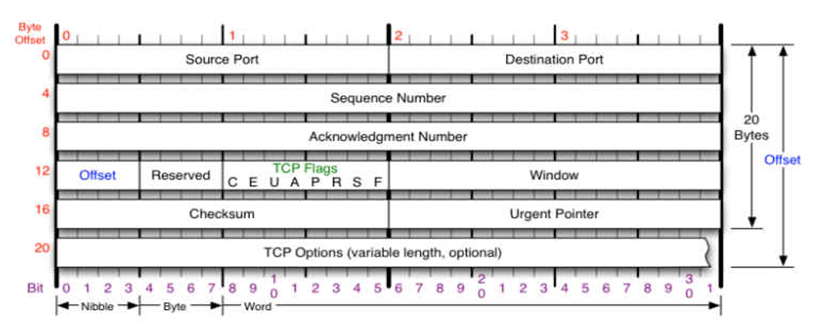
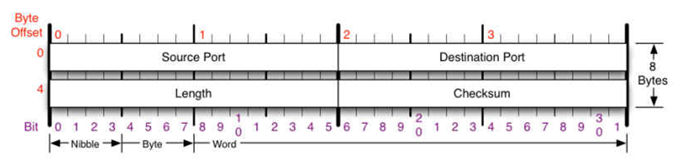
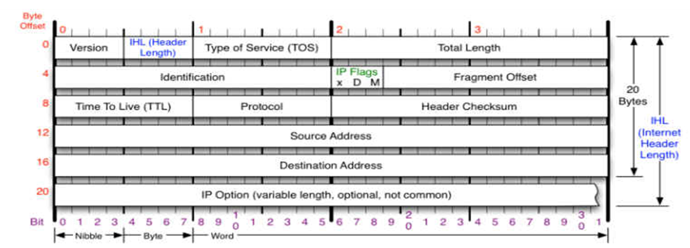

# TCP

## TCP 的报文格式

互连网早期的时候，主机间的互连使用的是NCP协议。这种协议本身有很多缺陷，如:不能互连不同的主机，不能互连不同的操作系统，没有纠错功能。为了改善这种缺点，大牛弄出了TCP/IP协议。现在几乎所有的操作系统都实现了TCP/IP协议栈。

TCP/IP协议栈主要分为四层:应用层、传输层、网络层、数据链路层,每层都有相应的协议，如下图

所谓的协议就是双方进行数据传输的一种格式。整个网络中使用的协议有很多,所幸的是每一种协议都有RFC文档。在这里只对IP、TCP、UDP协议头做一个分析。

首先来看看在网络中，一帧以太网数据包的格式：

在Linux 操作系统中，当我们想发送数据的时候，我们只需要在上层准备好数据，然后提交给内核协议栈 , 内核协议栈自动添加相应的协议头。

下面我们来看看，每一层添加的协议头具体内容。

一. TCP协议

TCP协议是面向连接、保证高可靠性(数据无丢失、数据无失序、数据无错误、数据无重复到达)传输层协议。

1.TCP头分析

先来分析一下TCP头的格式以及每一个字段的含义:

(1)端口号[16bit]

我们知道，网络实现的是不同主机的进程间通信。在一个操作系统中，有很多进程，当数据到来时要提交给哪个进程进行处理呢?这就需要用到端口号。在TCP头中，有源端口号(Source Port)和目标端口号(Destination Port)。源端口号标识了发送主机的进程,目标端口号标识接受方主机的进程。

(2)序号[32bit]

序号分为发送序号(Sequence Number)和确认序号(Acknowledgment Number)。

发送序号：用来标识从 TCP源端向 TCP目的端发送的数据字节流，它表示在这个报文段中的第一个数据字节的顺序号。如果将字节流看作在两个应用程序间的单向流动，则 TCP用顺序号对每个字节进行计数。序号是 32bit的无符号数，序号到达 2  32－ 1后又从 0开始。当建立一个新的连接时， SYN标志变 1，顺序号字段包含由这个主机选择的该连接的初始顺序号 ISN（ Initial Sequence Number）。

确认序号：包含发送确认的一端所期望收到的下一个顺序号。因此，确认序号应当是上次已成功收到数据字节顺序号加 1。只有 ACK标志为 1时确认序号字段才有效。 TCP为应用层提供全双工服务，这意味数据能在两个方向上独立地进行传输。因此，连接的每一端必须保持每个方向上的传输数据顺序号。

(3)偏移[4bit]

这里的偏移实际指的是TCP首部的长度，它用来表明TCP首部中32 bit字的数目，通过它可以知道一个TCP包它的用户数据是从哪里开始的。这个字段占4bit,如4bit的值是0101,则说明TCP首部长度是5 * 4 = 20字节。 所以TCP的首部长度最大为15 * 4 = 60字节。然而没有可选字段，正常长度为20字节。

(4)Reserved [6bit]

目前没有使用，它的值都为0

(5)标志[6bit]

在TCP首部中有6个标志比特。他们中的多个可同时被置为1 。

URG     紧急指针(urgent pointer)有效

ACK     确认序号有效

PSH      指示接收方应该尽快将这个报文段交给应用层而不用等待缓冲区装满

RST      一般表示断开一个连接

例如:一个TCP的客户端向一个没有监听的端口的服务器端发起连接,wirshark抓包如下

可以看到host:192.168.63.134向host:192.168.63.132发起连接请求，但是host：192.168.63.132并没有处于监听对应端口的服务器端,这时

host : 192.168.63.132发一个RST置位的TCP包断开连接。

SYN     同步序号用来发起一个连接

FIN      发送端完成发送任务(即断开连接)

(6)窗口大小(window)[16bit]

窗口的大小，表示源方法最多能接受的字节数。。

(7)校验和[16bit]

校验和覆盖了整个的TCP报文段:TCP首部和TCP数据。这是一个强制性的字段，一定是由发端计算和存储，并由收端进行验证。

(8)紧急指针[16bit]

只有当URG标志置为1时紧急指针才有效。紧急指针是一个正的偏移量，和序号字段中的值相加表示紧急数据最后一个字节的序号。TCP的紧急方式是发送端向另一端发送紧急数据的一种方式。

(9)TCP选项

是可选的,在后面抓包的时候，我们在看看它

2.重点详解

(1)三次握手建立连接

a.请求端(通常称为客户)发送一个SYN段指明客户打算连接的服务器的端口，以及初始序号(ISN,在这个例子中为1415531521)。这个SYN段为报文段1。

b.服务器发回包含服务器的初始序号的SYN报文段(报文段2)作为应答。同时，将确认序号设置为客户的ISN加1以对客户的SYN报文段进行确认。一个SYN将占用一个序号

c.客户必须将确认序号设置为服务器的ISN加1以对服务器的SYN报文段进行确认(报文段3)

这三个报文段完成连接的建立。这个过程也称为三次握手(three-way handshake)

前三次是三次握手的过程，后面三次是传送数据的过程，由于数据大小是4096个字节，所以用了三次进行传递(1448 + 1448 + 1200)。

细心的人会问为什么每次传送的最大数据大小不是1460个字节呢?因为这里的TCP携带可选项，TCP头长度 = 20 + 12（可选选项大小） = 32字节。 这样能传输的最大数据为:1500 - 20 - 32 = 1448个字节。

(2)四次挥手断开连接

a.现在的网络通信都是基于socket实现的，当客户端将自己的socket进行关闭时，内核协议栈会向服务器自动发送一个FIN置位的包，请求断开连接。我们称首先发起断开请求的一方称为主动断开方。

b.服务器端收到请客端的FIN断开请求后，内核协议栈会立即发送一个ACK包作为应答，表示已经收到客户端的请求

c.服务器运行一段时间后，关闭了自己的socket。这个时候内核协议栈会向客户端发送一个FIN置位的包，请求断开连接

d.客户端收到服务端发来的FIN断开请求后，会发送一个ACK做出应答，表示已经收到服务端的请求

(3)TCP可靠性的保证

TCP采用一种名为“带重传功能的肯定确认（positive acknowledge with retransmission）”的技术作为提供可靠数据传输服务的基础。这项技术要求接收方收到数据之后向源站回送确认信息ACK。发送方对发出的每个分组都保存一份记录，在发送下一个分组之前等待确认信息。发送方还在送出分组的同时启动一个定时器，并在定时器的定时期满而确认信息还没有到达的情况下，重发刚才发出的分组。图3-5表示带重传功能的肯定确认协议传输数据的情况，图3-6表示分组丢失引起超时和重传。为了避免由于网络延迟引起迟到的确认和重复的确认，协议规定在确认信息中稍带一个分组的序号，使接收方能正确将分组与确认关联起来。

从图 3-5可以看出，虽然网络具有同时进行双向通信的能力，但由于在接到前一个分组的确认信息之前必须推迟下一个分组的发送，简单的肯定确认协议浪费了大量宝贵的网络带宽。为此， TCP使用滑动窗口的机制来提高网络吞吐量，同时解决端到端的流量控制。

(4)滑动窗口技术

滑动窗口技术是简单的带重传的肯定确认机制的一个更复杂的变形，它允许发送方在等待一个确认信息之前可以发送多个分组。如图 3-7所示，发送方要发送一个分组序列，滑动窗口协议在分组序列中放置一个固定长度的窗口，然后将窗口内的所有分组都发送出去；当发送方收到对窗口内第一个分组的确认信息时，它可以向后滑动并发送下一个分组；随着确认的不断到达，窗口也在不断的向后滑动。

二、UDP协议

UDP协议也是传输层协议，它是无连接，不保证可靠的传输层协议。它的协议头比较简单，如下:

这里的端口号就不解释了,和TCP的端口号是一样的含义。

Length占用2个字节，标识UDP头的长度。

Checksum : 校验和,包含UDP头和数据部分。

三、IP协议

I P是T C P / I P协议族中最为核心的协议。所有的T C P、U D P、I C M P及I G M P数据都以I P数据报格式传输。它的特点如下:
不可靠（u n r e l i a b l e）的意思是它不能保证 I P数据报能成功地到达目的地。 I P仅提供最好的传输服务。如果发生某种错误时，如某个路由器暂时用完了缓冲区， I P有一个简单的错误处理算法：丢弃该数据报，然后发送 I C M P消息报给信源端。任何要求的可靠性必须由上层来提供（如T C P） 。
无连接（c o n n e c t i o n l e s s）这个术语的意思是I P并不维护任何关于后续数据报的状态信息。每个数据报的处理是相互独立的。这也说明， I P数据报可以不按发送顺序接收。如果一信源向相同的信宿发送两个连续的数据报（先是 A，然后是B） ，每个数据报都是独立地进行路由选择，可能选择不同的路线，因此B可能在A到达之前先到达。

1.IP 头格式

(1)版本　占4位，指IP协议的版本。通信双方使用的IP协议版本必须一致。目前广泛使用的IP协议版本号为4（即[IPv4](http://blog.chinaunix.net/uid-26833883-id-3627644.html)）。关于[IPv6](http://blog.chinaunix.net/uid-26833883-id-3627644.html)，目前还处于草案阶段。 

(2)首部长度　占4位，可表示的最大十进制数值是15。请注意，这个字段所表示数的单位是32位字长（1个32位字长是4字节），因此，当IP的首部长度为1111时（即十进制的15），首部长度就达到60字节。当IP分组的首部长度不是4字节的整数倍时，必须利用最后的填充字段加以填充。因此数据部分永远在4字节的整数倍开始，这样在实现IP协议时较为方便。首部长度限制为60字节的缺点是有时可能不够用。但这样做是希望用户尽量减少开销。最常用的首部长度就是20字节（即首部长度为0101），这时不使用任何选项。 

(3)区分服务　占8位，用来获得更好的服务。这个字段在旧标准中叫做服务类型，但实际上一直没有被使用过。1998年IETF把这个字段改名为区分服务DS(Differentiated Services)。只有在使用区分服务时，这个字段才起作用。 

(4)总长度　总长度指首部和数据之和的长度，单位为字节。总长度字段为16位，因此数据报的最大长度为216-1=65535字节。 

在IP层下面的每一种数据链路层都有自己的帧格式，其中包括帧格式中的数据字段的最大长度，这称为最大传送单元MTU(Maximum Transfer Unit)。当一个数据报封装成链路层的帧时，此数据报的总长度（即首部加上数据部分）一定不能超过下面的数据链路层的MTU值。 

(5)标识(identification)　占16位。IP软件在存储器中维持一个计数器，每产生一个数据报，计数器就加1，并将此值赋给标识字段。但这个“标识”并不是序号，因为IP是无连接服务，数据报不存在按序接收的问题。当数据报由于长度超过网络的MTU而必须分片时，这个标识字段的值就被复制到所有的数据报的标识字段中。相同的标识字段的值使分片后的各数据报片最后能正确地重装成为原来的数据报。 

(6)标志(flag)　占3位，但目前只有2位有意义。 

●　标志字段中的最低位记为MF(More Fragment)。MF=1即表示后面“还有分片”的数据报。MF=0表示这已是若干数据报片中的最后一个 

●　标志字段中间的一位记为DF(Don’t Fragment)，意思是“不能分片”。只有当DF=0时才允许分片。 

(7)片偏移　占13位。片偏移指出：较长的分组在分片后，某片在原分组中的相对位置。也就是说，相对用户数据字段的起点，该片从何处开始。片偏移以8个字节为偏移单位。这就是说，每个分片的长度一定是8字节（64位）的整数倍。 

(8)生存时间　占8位，生存时间字段常用的的英文缩写是TTL(Time To Live)，表明是数据报在网络中的寿命。由发出数据报的源点设置这个字段。其目的是防止无法交付的数据报无限制地在因特网中兜圈子，因而白白消耗网络资源。最初的设计是以秒作为TTL的单位。每经过一个路由器时，就把TTL减去数据报在路由器消耗掉的一段时间。若数据报在路由器消耗的时间小于1秒，就把TTL值减1。当TTL值为0时，就丢弃这个数据报。 

(9)协议　占8位，协议字段指出此数据报携带的数据是使用何种协议，以便使目的主机的IP层知道应将数据部分上交给哪个处理过程。 

(10)首部检验和　占16位。这个字段只检验数据报的首部，但不包括数据部分。这是因为数据报每经过一个路由器，路由器都要重新计算一下首部检验和（一些字段，如生存时间、标志、片偏移等都可能发生变化）。不检验数据部分可减少计算的工作量。 

(11)源IP地址　占32位。 

(12)目的IP地址　占32位。

2.分片解释

分片指的是需要传送的数据大于最大传输单元（MTU）的时候，就需要分成多个包，然后一个个发送给对方。我们在说TCP的时候，说到MSS很多人不能区分它们。通过下面的图，我想就可以完全区分它们了。

可以看到，但数据提交到网络层的时候，由于数据超过了最大传输单元，就分片了。分成多个包通过IP协议发送个对方。每个数据包最大的字节为MTU - IP头 = 1500 - 20 = 1480。

四 、以太网头