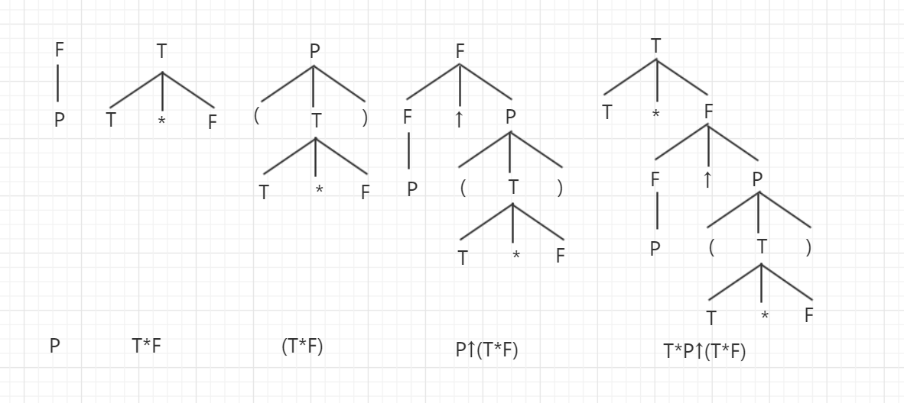

## 短语，直接短语，句柄，素短语，最左素短语

#### （一）明确概念：

| 名称       | 概念                                                         |
| ---------- | ------------------------------------------------------------ |
| 短语       | **定义：** 若 S 为文法 G 的开始符号，αβδ 是该文法的一个句型，即 S ⇒* αβδ，且有 A ⇒+ β，则称 β 是句型 αβδ 相对于非终结符 A 的短语。**语法树：** 在语法树中表示所有分支结点对应子树，短语即子树叶子对应的符号。**注：** 子树包括语法树本身，及句型本身也可以称为短语。 |
| 直接短语   | **定义：** 若 S ⇒* αβδ，且文法中包含产生式 A → β，则称 β 是句型 αβδ 相对于非终结符 A 的直接短语。**语法树：** 在语法树中表示为该短语只有上下相邻父子两代 |
| 句柄       | “可规约串”，句柄对应某个产生式的右部，是某个，但不是任意一个。作为一种规约对象，**句柄表示最左直接短语**。**语法树：** 在语法树上，则表示为最左边的只包含相邻父子节点的短语（最左直接短语） |
| 素短语     | **定义：** 是指一个短语至少包含一个终结符，并且除它自身之外不再包含其他素短语 |
| 最左素短语 | **定义：** 最左素短语就是句型最左边的素短语，是算符优先分析法的规约对象。**语法树：** 通过语法树分析时，要注意先判断是否为素短语，再找相对最左端的素短语。 |

#### 例题1：求短语，直接短语，句柄

**给定句型：**

T*P↑(T*F)

**给定文法：**

> **G[T]:
> T → T\*F|F
> F → F↑P|P
> P → (T)|i**

##### 解析：

**推导步骤为：**

T ⇒ T*F
⇒ T*F↑P
⇒ T*P↑P
⇒ T*P↑(T)
⇒ T*P↑(T*F)

**画出语法树为：**

**该语法树的 5 个子树及 5 个短语为：**

**求直接短语方法：** 该句型的语法树有两颗直接子树（最左边的两颗子树），由这两颗直接子树的叶子结点组成的符号串（或者说只包含两层的子树叶子结点对应的），就是句型的两个直接短语，直接短语 P 和 T*F。

**求句柄：** 因为 P 相对 T*F，在语法树上的左侧，所以句柄是 P

**最终结果：**

| 类型          | 内容                              |
| ------------- | --------------------------------- |
| 短语 5 个     | P，T*F，(T*F)，P↑(T*F)，T*P↑(T*F) |
| 直接短语 2 个 | P，T*F                            |
| 句柄          | P                                 |

#### 例题二：求素短语，最左素短语

**给定句型：**

FF↑*a*

**给定文法：**

> **G[T]:
> T → T\*F|F
> F → F↑P|P
> P → (T)|i**

##### 解析：

**推导步骤为：**

T ⇒ TF*
⇒ TF*F*
⇒ TF↑ * F
⇒ TF↑*a*

**画出语法树：**

**最终结果：**

根据定义可以找出素短语有：

| 类型        | 内容  |
| ----------- | ----- |
| 素短语 2 个 | F↑，a |
| 最左素短语  | F↑    |