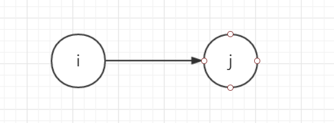
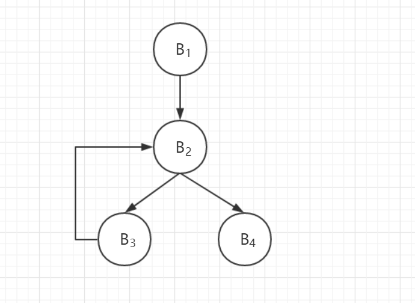

# 语义分析

## 控制流语句 if 和 while 语句的翻译

将 if 和 while 语句翻译成四元式

注：不同教材会有小差异，使用 _ 或者 — ，如果是 —，请注意区分 — 和 - 减号

### （一）四元式

四元式是普遍采用的一种中间代码形式，由于它便于优化处理，所以目前在很多编译程序中得到广泛应用。

| 形式     | 表示                          |
| -------- | ----------------------------- |
| 一般形式 | （op ，arg1 ，arg2 ，result） |
| 一目运算 | （op ，arg1 ，____ ，result） |
| 0元运算  | （op ，____ ，____，result）  |

**如：a:= -b+c\*d的四元式为：**

（:= 表示赋值，用于区分 =）

> **(1) ( - , b , __ , T1 )
> (2) ( \* , c , d , T2 )
> (3) ( + , T1 , T2 , T3 )
> (4) ( := , T3 , __ , a )**

T1 := -b
T2 := c * d
T3 := T1 + T2
a : = T3

**四元式的最大优点：**

在实现代码优化时，通常需要从现有的运算序列删去某些运算，或者需要挪动一些运算的位置，这对于四元式序列来说，是比较容易实现的。

因为四元式之间的联系是通过临时变量来实现的，所以更改其中一些四元式给整个序列带来的影响较小

### （二）if 语句的翻译

描述 if 语句的文法如下：

> **if E then S1**

或者

> **if E then S1 else S2**

其中 E 为布尔表达式
S1，S2 本身也可以是 if 语句或者其他语句

#### 控制语句中的回填技术

一些转移地址并不能不产生这些四元式的同时得知。

也就是说，一个布尔式的真假出口往往不能在产生四元式的同时就确定。
因此，要回填这些地址

#### 拉链

为了记录需回填地址的四元式，采用 “拉链” 的方法。

把需回填 E.true 的四元式拉成一链，把需回填 E.false 的四元式拉成一链，分别称做“真”链和“假”链

#### IF 语句翻译过程

IF 语句翻译过程大致如下：

(1) 翻译 E，获得一组四元式；
(2) 扫描 E 的真出口，回填；
假出口尚不知；
(3) 翻译 S(1) ；
(4) 遇到 else，S(1) 结束，生成一条无条件转移四元式，但出口不明；
(5) 翻译 S(2) ，结束。

#### if 语句的翻译例题：

对下语句进行翻译：

```java
if A > B or C then
    if D<E then F:=F+1 
    else F:=F-1
else F:=0;
```

四元式从 100 开始编号：

> **100 ( j> , A , B , 104 )
> 101 ( j , _ , _ , 102 )
> 102 ( jnz, C , _ , 104 )
> 103 ( j , _ , _ , 112 )
> 104 ( j< , D , E , 106 )
> 105 ( j , _ , _ , 109 )
> 106 ( + , F , 1 , T1 )
> 107 ( := , T1 , _ , F )
> 108 ( j , _ , _ , 113 )
> 109 ( - , F , 1 , T2 )
> 110 ( := , T2 , _ , F)
> 111 ( j , _ , _ , 113 )
> 112 ( := , 0 , _ , F )
> 113 ...**

**解释：**

（1）第 100 号 ( j> , A , B , 104 ) ，表式示如果满足 A > B，此时四元式第四个表示结果的是 104，就表示跳转到 104 号执行，是一个真出口；如果不满足就会继续走到下个序号的四元式 101 号。
（2）第 101 号 ( j , _ , _ , 102 )，表示直接到 102。虽然没有这一句也能到达 102，但是它表表示上面不满足的状态，也叫假出口，必须要写。
（3）所以写条件要一写一对，因为不满足就走到下一个序号的四元式，并且假出口只能在它相邻的下面。
（4）第 102 号 ( jnz, C , _ , 104 )，只有一个参数，操作符时 jnz，然后同样是满足则到 104，不满足走到下一个序号的四元式。
（5）第 106 号 ( + , F , 1 , T1 )，T1 是 F + 1 的结果，此时不表示跳转，不跳转也就是走到下个序号的四元式。
（6）注意赋值语句的表示，第 107 号 ( := , T1 , _ , F )，是将被赋值的元素放在结果的位置上，就是四元式第四个位置。

### （三）while 语句的翻译

#### while 语句的翻译过程

while 语句的翻译过程大致如下：
(1) 翻译 E，待填 E 的真链、假链；
(2) 扫描 do 后，回填 E 的真链；
(3) 翻译 S 语句称代码段；
(4) 无条件转移到 E 代码段的第一条四元式，若 S 有语句链，也应转到 E 代码段的第一条四元式。

#### while 语句的翻译例题

对下语句进行翻译：

```java
While (a<b) do
{ a=a+3;
  b=b-3;    
}
```

四元式从 100 开始编号：

> **101 (j<, a, b, 103) 真出口
> 102 (j, _ , _ , 108) 假出口
> 103 (+, a, 3, T1)
> 104 (:=, T1, _ , a)
> 105 (-, b, 3, T2)
> 106 (:=, T2, _ , b)
> 107 (j, _ , _ , 101)
> 108 ...**

**解释：**

（1）原理同上
（2）注意赋值语句的表示，例如第 104 号 (:=, T1, _, a)，是将被赋值的元素放在结果的位置上，就是四元式第四个位置。

## 画 DAG 图与求优化后的 4 元式代码

DAG 图（Directed Acylic Graph）无环路有向图

#### （一）基本块

基本块是指程序中一顺序执行的语句序列，其中只有一个入口语句（第一个语句）和一个出口语句（最后一个语句）

对于一个基本块来说，执行时只能从其入口语句进入，从其出口语句退出

| 语句     |                    |
| -------- | ------------------ |
| 出口语句 | 任何控制转移四元式 |
| 入口语句 | 所转向的目标语句   |

#### （二）划分基本块的步骤

1、求四元式序列中各个基本块的入口语句。

- **① 程序的第一个语句**
- **② 能由条件或无条件转移语句转移到的语句**
- **③ 紧跟在条件转移语句后面的语句**

2、对每一入口语句，构造所属的基本块，该基本块由：

- 1）该入口语句到下一入口语句（不包括下一入口语句）之间的语句序列组成
- 2）该入口语句到一转移语句（包括该转移语句）之间的语句序列组成
- 3）该入口语句到一停语句（包括该停语句）之间的语句序列组成

3、凡是未包含在某一基本块中的语句，都是程序中控制流程不可达的语句，可删除它们。

##### 例题：

对于下面给出的求最大公因子的程序，可以根据基本块的构造规则与其划分基本块


**基本块构造步骤：**

（1）：由规则 (1) 中的 ① 可知语句 (1) 是一个入口语句
（2）：由规则 (1) 中的 ② 可知，语句 (3) 和 (8) 均是人口语句
（3）：由规则 (1) 中的 ③ 可知，语句 (5) 是二个人口语句，可以用 “+” 在人口语句的左侧作标记。
（4）：由规则 (2) 可以划分该程序为四个基本块，它们分别是：

- 语句 (1)、(2) 组成的基本块 B1
- 语句 (3)、(4) 组成的基本块 B2
- 语句 (5)、(6) 和 (7) 组成的基本块 B3
- 语句 (8) .(9) 组成的基本块 B4

程序中在代码段左侧对各个基本块进行了标记。

#### （三）程序控制流程流图

**定义：** 以基本块为结点，控制程序流向作为有向边，画出的有向图称为流图。

**特点：**

- 具有唯一首结点的有向图
- 从首结点开始到流图中任何结点都有通路

如果一个结点的基本块的入口语句是程序的第一条语句，则称此结点为首结点

##### 程序控制流程流图的表示

一个控制流程图可表示成一个三元组：
G=(N，E，n0 )

N：所有结点(基本块)集；
E：所有有向边集；
n0 ：首结点。

**有向边：**

当下述条件有一个成立时，从结点i有一有向边引向结点 j：

- ① 基本块 j 在程序的位置紧跟在i后，且 i 的出口语句不是无条件转移或停语句
- ② i 的出口是 goto(S) 或 if goto(S)，而 (S) 是 j 的入口语句



##### 构造程序控制流图

对程序基本块：


构造以下程序控制流图：



#### （四）基本块的 DAG 表示

DAG Directed Acyclic Graph 无环路有向图

**定义：**

(1) 在一个有向图中，若结点 ni 有弧指向结点 nj，则 ni 是 nj 的父结点，nj 是 ni 的子结点；
(2) 若 n1,n2,…,nk 间存在有向弧 n1→n2→…→nk，则称 n1 到 nk 之间存在一条通路，若有 nk=n1，则称该通路为环路；
(3) 若有向图中任意通路都不是环路，则称该图为无环路有向图（DAG）

**用来描述基本块的 DAG：**

(1) 图的叶结点以一标识符或常数做标记，表示该结点代表该变量或常数的值。
(2) 图的内部结点以一运算符作为标记；
(3) 图中各个结点上可能附加一个或多个标识符，表示这些标识符具有该结点所代表的值，简称附标。

**四元式对应的 DAG 结点形式**

按其四元式对应结点的后继个数分成四种类型：0型、1型、2型、3型


#### （五）DAG 图构造例题

对于基本块 P

> **（1）S0 := 2
> （2）S4 := 2
> （3）S1 := 1.5
> （4）S2 := T-C
> （5）S3 := T+C
> （6）S5 := S3
> （7）R := 2/S3
> （8）S6 := R
> （9）H := R\*S2**

（1）试用 DAG 进行优化并重写基本块
（2）假定只有 R，H 在基本块出口是活跃的，试写出优化后的 4 元式序列
（只需要还原活跃变量）

##### 解析：

**（1）画出 DAG 图如下：**

画图的步骤就是：根据基本块，一部一部组装


**（2）假定只有 R，H 在基本块出口是活跃的，试写出优化后的 4 元式序列
（只需要还原活跃变量）**

优化后的 4 元式代码可以写为：
（1）S2 := T-C
（2）S3 := T+C
（3）R := 2/S3
（4）H := R*S2

**解释：**

与原来的基本块相比较可以看出：

- 原基本块中的 (2) 和 (7) 中的已知量都已经合并。因为 (2) 中 S4 := 2，(7) 中用 2，所以合并。
- (5) 和 (8) 中的公共子表达式 T+C 只在 (5) 中计算一次，在 (8) 中 直接引用其结果，所以删除了多余运算。
- (6) 中的无用赋值已被删除。S5 := S3，S5 后面没有再用，所以就和 S3 一起表示。

除了可以应用 DAG 进行上述的优化外，还可以从基本块的 DAG 中得到一些其他信息：

- DAG 叶结点上标记的标识符是在该基本块之前的基本块内被定值，并在该基本块内被引用的标识符。
- DAG 各结点上的附加标识符是在基本块内被定值，并可以在基本块后被引用的标识符。

如果确认某结点的一个附加标记在基本块后不会被引用，则该标识符的定值语句可以作为死代码被删除。

假设上面例子中 S0~S6。在基本块后面都不会被引用只有 R, H 在基本块出口是活跃的则优化后的四元式序列可以写为：
（1）S2 := T-C
（2）S3 := T+C
（3）R := 2/S3
（4）H := R*S2