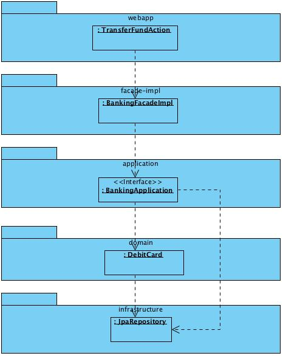
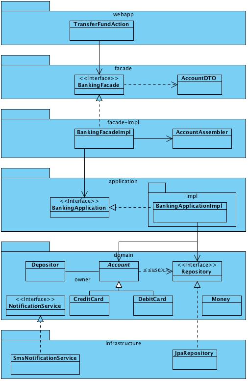

# 基于DDD(领域驱动设计)的分层架构

DDD是一种设计思想，它本身不绑定到任何一种具体的架构风格，可以应用在多种不同的架构风格中。本文探讨在经典的分层架构中如何应用DDD，以及在DDD的语境下，分层结构每一层的具体职责。

分层架构是企业应用开发中采用率非常高的一种架构风格。它将软件系统的不同职责划分到不同的逻辑层中，并严格定义这些逻辑层的调用顺序。

在《领域驱动设计——软件核心复杂性的应对之道》一书中，DDD范式的创始人Evans提出下图所示的这样一种分层架构：[](https://xssv.cn/wp-content/uploads/2020/10/layered-architecture.png)

整个系统划分为基础设施层（Infrastructure）、领域层（Domain）、应用层（Application）和用户接口层（User Interface，也称为表示层）。下面从各个维度分别讨论之。

## 职责分配

四个逻辑层之间有着明确的职责划分。

### 领域层（Domain Layer）

```
领域层实现业务逻辑。
```

什么是业务逻辑？业务逻辑就是存在于问题域即业务领域中的实体、概念、规则和策略等，与具体的实现技术无关，主要包含下面的内容：

- 业务实体（领域对象）。例如银行储蓄领域中的账户、信用卡等等业务实体。
- 业务规则。例如借记卡取款数额不得超过账户余额，信用卡支付不得超过授信金额，转账时转出账户余额减少的数量等于转入账户余额增加的数量，取款、存款和转账必须留下记录，等等。
- 业务策略。例如机票预订的超订策略（卖出的票的数量稍微超过航班座位的数量，以防有些旅客临时取消登机导致座位空置）等。
- 完整性约束。例如账户的账号不得为空，借记卡余额不得为负数等等。本质上，完整性约束是业务规则的一部分。
- 业务流程。例如，“在线订购”是一个业务流程，它包括“用户登录-选择商品-结算-下订单-付款-确认收货”这一系列流程。

对领域层的进一步说明如下：

- **领域层映射到领域模型，是问题域的领域模型在软件中的反映。**
- 包含实体、值对象和领域服务等领域对象，通常这些领域对象和问题域中的概念实体一一对应，具有相同或相似的属性和行为。
- 在实体、值对象和领域服务等领域对象的方法中封装实现业务规则和保证完整性约束（这一点是与CRUD模式相比最明显的差别，CRUD中的领域对象没有行为）。
- 领域对象在实现业务逻辑上具备坚不可摧的完整性，意味着不管外界代码如何操作，都不可能创建不合法的领域对象（例如没有账户号码或余额为负数的借记卡对象），亦不可能打破任何业务规则（例如在多次转账之后，钱凭空丢失或凭空产生）。
- 领域对象的功能是高度内聚的，具有单一的职责，任何不涉及业务逻辑的复杂的组合操作都不在领域层而在应用层中实现。
- 领域层中的全部领域对象的总和在功能上是完备的，意味着系统的所有行为都可以由领域层中的领域对象组合实现。

### 应用层（Application Layer）

```
应用层定义系统的业务功能，并指挥领域层中的领域对象实现这些功能。
```

应用层是整个系统的功能外观，封装了领域层的复杂性并隐藏了其内部实现机制。

- **应用层映射到系统用例模型，是系统用例模型在软件中的反映。**
- 应用层接口描述了系统的全部功能，意味着系统用例模型中的所有用例都可以在应用层接口中找到对应的方法。
- 应用层实现类不实现业务逻辑，它通过排列组合领域层的领域对象来实现用例，它的职责可表示为“编排和转发”，即将它要实现的功能委托给一个或多个领域对象来实现，它本身只负责安排工作顺序和拼装操作结果。

### 基础设施层（Infrastructure Layer）

```
基础设施层为其余各层提供技术支持。
```

基础设施层是系统中的技术密集部分。它为领域层、应用层的业务服务（例如持久化、消息通信等等）提供具体的技术支持，用户接口层通常使用特定的表示层框架（例如SpringMVC、Struts或Tapestry）实现，但有需要时也可以申请技术设施层提供专门的技术支持。

一些例子：

- 领域层需要持久化服务，在DDD中，领域层通过仓储（Repository）接口定义持久化需求，基础设施层通过采用JDBC、JPA、Hibernate、NoSQL等技术之一实现领域层的仓储接口，为领域层提供持久化服务。
- 领域层需要消息通知服务，在领域层中定义了一个NotificationService领域服务接口，基础设施层通过采用手机短信、电子邮件、Jabber等技术实现NotificationService领域服务接口，为领域层提供消息通知服务。
- 用户接口层需要一个对象序列化服务，将任何JavaBean序列化为JSON字符串，可以在用户接口层定义一个ObjectSerializer服务接口，基础设施层通过采用Gson实现这一接口，为用户接口层提供对象序列化服务。

以上例子都是满足依赖倒置原则，通过控制反转的方式为高层模块提供低层服务，在实践中，可以通过Spring等IoC容器将基础设施层的实现类实例进行依赖注入。

基础设施层的典型实现形式是提供一个一个的类，这些类使用某些专有的技术实现其余各层（主要是领域层）定义的接口，例如提供一个领域层的仓储接口的实现类，使用Hibernate实现持久化，以及提供领域层的通知接口的实现类，使用ActiveMQ广播领域层中发生的事件，等等。

基础设施层也被称为数据源层或数据访问层。这些名称的一个缺点是给读者一个强烈的暗示：基础设施层只负责数据库访问。虽然数据库访问是基础设施层的职责之一，但基础设施层的负责范围比单纯数据库访问宽广的多，它实现了系统的全部技术性需求，例如上面例子中的通知服务和对象序列化服务，等等。

### 用户接口层（User Interface）

```
用户接口层为外部用户访问底层系统提供交互界面和数据表示。
```

用户接口层在底层系统之上封装了一层可访问外壳，为特定类型的外部用户（人或计算机程序）访问底层系统提供访问入口，并将底层系统的状态数据以该类型客户需要的形式呈现给它们。

用户接口层有两个任务：（1）从用户处接收命令操作，改变底层系统状态；（2）从用户处接收查询操作，将底层系统状态以合适的形式呈现给用户。

说明：

- 典型的用户是人类用户，但是也可能是别的计算机系统。例如如果ERP系统要访问我们的系统获取信息，它也是一种用户。
- 不同类型的用户需要不同形式的用户接口，例如为人类用户提供Web界面和手机App，为ERP软件用户提供REST服务接口。
- 不同类型的用户需要不同形式的数据表示，包括表现形式的不同（XML、JSON、HTML）和内容的不同（例如手机App中呈现的数据内容往往比Web页面中呈现的少）。
- 用户接口层对应用层进行封装，用户接口层的操作与应用层上定义的操作通常是一一对应的关系。用户接口层从外部用户处接受输入，转换成应用层方法的参数形式，调用应用层方法将任务交由底层系统执行，并将返回结果转换成合适的形式返回给外部用户。
- 用户界面层的典型任务是下面三个：校验——校验外部客户输入的数据是否合法；转换——将外部客户的输入转换成对底层系统的方法调用参数，以及将底层系统的调用结果转换成外部客户需要的形式；转发——将外部客户的请求转发给底层系统。

用户接口层也被称为用户界面层或表示层。

有时候，为了某些需要，我们可以从用户接口层中分离出一个亚层，可命名为门面层（Facade）。位于真正的用户接口层和应用层之间。

### 门面层(Facade Layer)

```
门面层隔离前台和后台系统，定义特定于用户接口层的数据结构，从后台获取数据内容并转化为用户接口层的数据形式。
```

从用户接口层中分离出专门的门面层，具有下面的优势：

- 使得用户接口层能够独立于后台系统，与后台系统并行开发。

用户接口层通过门面层接口与应用层和领域层解耦，意味着用户接口层可以独立开发，不必等待后台系统的完成，亦不受后台系统重构的影响，在需求调研阶段系统原型出来并得到用户确认之后，就可以开始用户接口层的开发了。可以根据界面原型定义用户接口层需要的数据结构，该数据结构与底层数据结构解耦，不需要知道底层数据类型和数据之间的关联关系。将底层数据和界面数据连接起来并相互转换是门面层实现类的职责，这方面工作可以等待前后台系统分别完成之后进行。

- 使得分布式部署成为可能。

如果没有门面层的隔离，用户接口层只能直接使用领域层的领域对象作为自己的数据展现结构。这样我们就不能将系统进行分布式部署，将用户接口层和后台系统（领域层、应用层等）分别部署到不同的服务器上。因为在JPA和Hibernate等技术实现中，领域实体绑定到当前服务器的持久化上下文中，必须脱管之后才能够跨越JVM进行传输。更大的问题是事务问题，事务要跨越服务器的边界，复杂性增加，性能严重下降。门面层的存在使得实体和事务都限制在后台系统，不需要扩展到前台服务器。

- 避免Hibernate中“会话已关闭”的问题，消除成本巨大的“Open Session in View”模式的需要。

在采用JPA或Hibernate作为持久化手段的系统中存在臭名昭著的“会话已关闭”问题，对付这一问题的主要手段是Open Session in View这一存在潜在性能问题的方案。如果不采用门面层隔离后台数据结构，在前端展现数据需要访问实体的延迟初始化属性时就会遇到“会话已关闭”问题，而采用Open Session in View模式处理这个问题就意味着事务不是在后端完成而是扩展到前端用户接口层，在大访问量的网站上会遭遇严重的性能问题并降低吞吐量。采用门面模式的话，有关联关系的数据在后台拼装完毕再一次性返回给前端，事务局限在后端范围，不再有“会话已关闭”和性能问题。

门面层说明：

- 门面层特定于用户接口层，由用户接口层定义和控制（包括操作和数据的形式和内容），这意味着需要为不同类型的用户接口层开发专门的门面层。
- 查询结果通常以数据传输对象（DTO）的形式表示。DTO的结构由用户接口层而不是后端决定，代表前端需要的数据形式，与底层数据结构脱耦。一个DTO对象往往由来自领域层中多个相关实体类的数据聚合而成。
- 通过门面层实现类访问后端的应用层。实现类将后端数据拼装为DTO并返回给前端，它可以将数据装配职责委托给专门的Assembler工具类去执行。
- 在分布式系统中，可以在前端和后端分别部署门面层。前后端的门面层接口相同，但后端的门面层实现类负责数据装配和发布，前端的门面层实现类负责通过某种通信机制（Web Service等）与后端门面层通讯，获取后者装配好的数据。传输过程中DTO可能序列化为JSON或XML等形式。

### 综合说明

- 在四层架构中，领域层和应用层纯粹表达业务意图和机制，不包含任何技术逻辑；而基础设施层和用户接口层纯粹提供技术实现，不包含任何业务逻辑。在业务和技术之间存在清晰的关注点分离。
- 应用层定义系统的全部业务功能，领域层具体实现这些功能。领域层“动于内”，应用层“形诸外”。
- 应用层和领域层合在一起代表了整个业务系统，具备概念上的完整性（包含了全部领域概念，实现了全部的业务行为），但不具备实现上的完整性（没有基础设施层的技术支持，系统不具备可运行性；没有用户接口层支持，系统不具备可访问性）。
- 所有业务逻辑都在领域层实现，业务逻辑泄漏到应用层是一个错误，泄露到基础设施层或用户接口层是严重错误（在用户接口层中实现业务逻辑是采用CRUD模式的常犯的典型错误）。
- 领域层在履行职责的过程中如果需要技术支持，则在领域层中定义一个表达业务意图的领域服务接口，交由基础设施层采用各种具体技术去实现这一接口。保证领域层（和应用层）不被各种具体技术污染是逻辑分层的第一要务。
- 判断业务层（领域层和应用层）是否被具体技术污染一个方便的方式是检查它们是否有对具体技术框架（例如Spring和Hibernate）的编译时依赖。业务层代码应该只依赖于JDK（java.*）、Java规范（javax.*），以及一些被广泛使用的类库如commons-lang、Guava、SLF4J、JodaTime等，这些类库本质上可视为对JDK的补充，不是一种具体技术框架。
- 应用层和门面层的区别：应用层属于后端，门面层属于前端。应用层方法的参数和返回值可以包含领域对象，门面层方法的参数通常是字符串和数字等简单值，返回值是简单值或DTO。以转账操作为例子，应用层中的方法签名是这样的：void transferFund(Account from, Account to, Money amount, Date transferTime)，门面层中的方法签名是这样的：void transferFund(String fromAccountNumber, String toAccountNumber, BigDecimal amount, String currency, Date transferTime)。在门面层的实现类中，负责根据账户号码从仓储中获取Account对象，将amount和currency拼装成Money对象，然后以这些对象和transferTime为参数访问应用层中的相应方法。
- 领域层中的领域对象具有领域通用性或行业通用性，意味着可以在基本相同的领域层上建立不同的应用层（就像三极管、二极管、电容、电阻等在电子工业领域具有通用性，可以用来组装收音机、录音机、电视机等不同应用），应用层是应用特定或客户特定的，只为特定的应用或客户定制。相比应用层，领域层对象具备高度的可重用性。例如一套完备的用户管理领域层模块可以被OA、ERP、CRM、HRM、MES等多个应用重用。因为领域对象中封装了业务逻辑，这种重用是非常有价值的。
- 可以基于相同的应用层建立不同的用户接口层，例如Web页面，手机App、BI报表、RESTful Web Service等等。

## 各层间的调用关系与依赖关系

各层在运行时**对象**调用关系如下图所示：[](https://xssv.cn/wp-content/uploads/2020/10/122.jpg)

各层在编译时的**类**依赖关系如下图所示：[](https://xssv.cn/wp-content/uploads/2020/10/133.jpg)

图中infrastructure是基础设施层，domain是领域层，application是应用层，facade和facade-impl是门面层（前者是门面接口层，后者是门面实现层），webapp是用户接口层（采用web形式）。

这里有几个关键点：

- 基础设施层和其他各层的编译时依赖关系和运行时调用关系是相反的：在运行时，其他各层中的对象调用基础设施层中的对象实例，使用后者提供的服务；而在编译时，基础设施层中的类依赖于其他各层（主要是领域层）中的类。这是通过运用面向对象原则中的依赖倒置原则达到的，在领域层中定义服务接口，而在基础设施层中实现领域层定义的接口。在运行时，通过Spring等IoC容器向领域层中服务接口的客户类注入基础设施层中定义的实现类的实例。依赖倒置原则保证了领域层是主，基础设施层是仆。正如同建筑工程建设中的甲方和乙方，虽然甲方使用乙方提供的产品和服务，但乙方要完成的内容是由甲方指定和控制的，是乙方依赖于甲方，而不是甲方依赖于乙方。
- 代表业务的层（领域层和应用层）不依赖于代表技术的层（基础设施层和用户接口层），代表技术的层依赖于代表业务的层。这是天经地义的——业务提出需求，技术实现业务提出的需求。在保持业务层不变的前提下，可以变更技术层，实现可替换性——例如原来的基础设施层采用MyBatis实现持久化，可以自由替换为用JPA实现持久化；又例如原来的用户接口层基于Swing，可以自由替换为Web界面——在两种情况下，都不需要修改业务层。
- 领域层处于整个系统的核心位置，它在概念上不依赖于其他各层，其他各层都直接或间接依赖于它。领域层是整个系统的核心引擎，直接实现业务目标，攸关业务正确性、可靠性、灵活性和扩展性。应该把最优秀的人才和最大部分的精力放在领域建模和领域层开发上，这才是真正的“领域驱动设计”。
- 领域层应该是整个系统中最“胖”的一层，因为它实现了全部业务逻辑并且通过各种校验手段保证业务正确性，其余各层相对都较“瘦”。如果你的代码中不是如此，你肯定走错了路。胖用户接口层是“以数据库为中心的增删改查”模式的典型症状，胖应用层是事务脚本模式的典型症状。
- 通过定义门面接口（图中的facade），前端和后端概念上互相独立，互不依赖，可以并行开发实现。等到前后端系统都开发完毕，再开发门面实现（图中的facade-impl），将前端和后端系统粘合起来，成为一体。门面层接口的任务是“分”：将前台和后台在概念上分隔开来；门面层实现类的任务是“合”，将前台和后台粘合在一起，成为一个有机统一的完整系统。