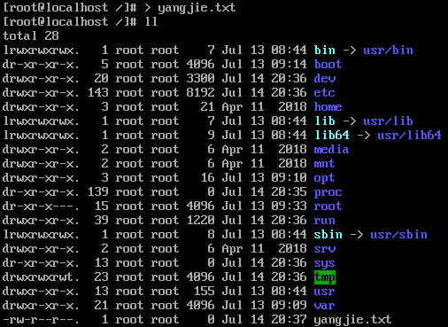
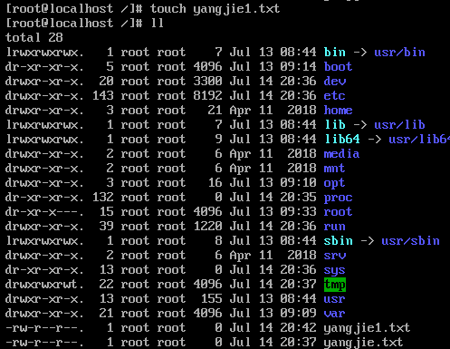
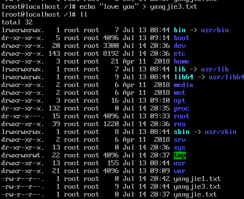
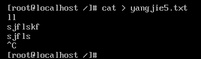
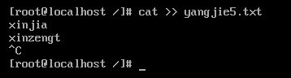
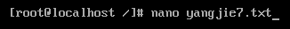
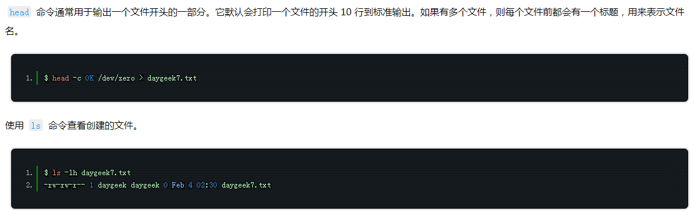
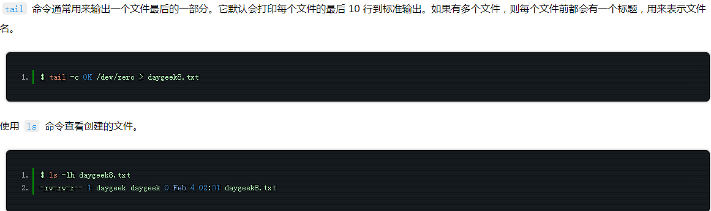
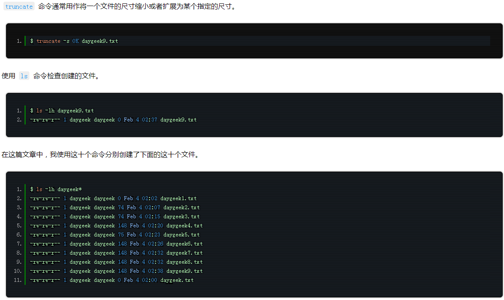

# linux创建文件/touch(最适合创建空文件)

[1、在 Linux 上使用重定向符（>）创建一个文件](https://www.pianshen.com/article/5215854488/#1、在 Linux 上使用重定向符（>）创建一个文件)

[2、 在 Linux 上使用 touch 命令创建一个文件](https://www.pianshen.com/article/5215854488/#2、 在 Linux 上使用 touch 命令创建一个文件)

[3、 在 Linux 上使用 echo 命令创建一个文件](https://www.pianshen.com/article/5215854488/#3、 在 Linux 上使用 echo 命令创建一个文件)

[4、 在 Linux 上使用 printf 命令创建一个新的文件](https://www.pianshen.com/article/5215854488/#4、 在 Linux 上使用 printf 命令创建一个新的文件)

[5、 在 Linux 中使用 cat 创建一个文件](https://www.pianshen.com/article/5215854488/#5、 在 Linux 中使用 cat 创建一个文件)

[6、 在 Linux 上使用 vi/vim 命令创建一个文件](https://www.pianshen.com/article/5215854488/#6、 在 Linux 上使用 vi%2Fvim 命令创建一个文件)

[7、在 Linux 上使用 nano 命令创建一个文件](https://www.pianshen.com/article/5215854488/#7、在 Linux 上使用 nano 命令创建一个文件)

[8、 在 Linux 上使用 head 命令创建一个文件](https://www.pianshen.com/article/5215854488/#8、 在 Linux 上使用 head 命令创建一个文件)

[9、 在 Linux 上使用 tail 创建一个文件](https://www.pianshen.com/article/5215854488/#9、 在 Linux 上使用 tail 创建一个文件)

[10、 在 Linux 上使用 truncate 命令创建一个文件](https://www.pianshen.com/article/5215854488/#10、 在 Linux 上使用 truncate 命令创建一个文件)

------

摘自[linux创建文件](https://blog.csdn.net/qq_41622739/article/details/95921494)

# 1、在 Linux 上使用重定向符（>）创建一个文件

标准重定向符允许我们创建一个 0KB 的空文件。它通常用于重定向一个命令的输出到一个新文件中。在没有命令的情况下使用重定向符号时，它会创建一个文件。
但是它不允许你在创建文件时向其中输入任何文本。然而它对于不是很勤劳的管理员是非常简单有用的。只需要输入重定向符后面跟着你想要的文件名。

# 2、 在 Linux 上使用 touch 命令创建一个文件

touch 命令常用于将每个文件的访问和修改时间更新为当前时间。
如果指定的文件名不存在，将会创建一个新的文件。touch 不允许我们在创建文件的同时向其中输入一些文本。它默认创建一个 0KB 的空文件。

# 3、 在 Linux 上使用 echo 命令创建一个文件

echo 内置于大多数的操作系统中。它常用于脚本、批处理文件，以及作为插入文本的单个命令的一部分。
它允许你在创建一个文件时就向其中输入一些文本。当然也允许你在之后向其中输入一些文本

你可以使用两个重定向符 (>>) 添加其他内容到同一个文件。

此时会追加内容在其中；

# 4、 在 Linux 上使用 printf 命令创建一个新的文件

用法同echo;

# 5、 在 Linux 中使用 cat 创建一个文件

cat 表示串联concatenate。在 Linux 经常用于读取一个文件中的数据。
cat 是在类 Unix 系统中最常使用的命令之一。它提供了三个与文本文件相关的功能：显示一个文件的内容、组合多个文件的内容到一个输出以及创建一个新的文件。（LCTT 译注：如果 cat 命令后如果不带任何文件的话，下面的命令在回车后也不会立刻结束，回车后的操作可以按 Ctrl-C 或 Ctrl-D 来结束。）

文件里面的内容是输入的内容；
如果你想向同一个文件中添加其他内容，使用两个连接的重定向符（>>）。

# 6、 在 Linux 上使用 vi/vim 命令创建一个文件

vim 是一个向上兼容 vi 的文本编辑器。它通常用来编辑所有种类的纯文本。在编辑程序时特别有用。
vim 中有很多功能可以用于编辑单个文件。

输入完之后会进入文件进入编辑模式；

# 7、在 Linux 上使用 nano 命令创建一个文件

nano 是一个编辑器，它是一个自由版本的 pico 克隆。nano 是一个小且用户友好的编辑器。它复制了 pico 的外观及优点，并且是一个自由软件，它添加了 pico 缺乏的一系列特性，像是打开多个文件、逐行滚动、撤销/重做、语法高亮、行号等等。

# 8、 在 Linux 上使用 head 命令创建一个文件

# 9、 在 Linux 上使用 tail 创建一个文件

# 10、 在 Linux 上使用 truncate 命令创建一个文件

