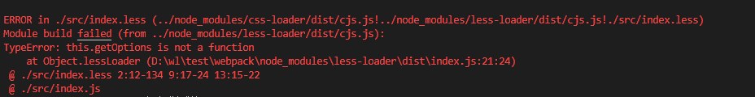

# 学习样式中遇到的坑

**今天用webpack打包项目，安装了less-loader模块之后报错，如下图：

**原因： less-loader安装的版本过高
**解决方案：**

1. npm uninstall less-loader

2. npm install less-loader@5.0.0

##sass

安装 sass 使用所需要的依赖

```bash
npm i sass-loader node-sass --save-dev
```

在项目中使用

```html
<style lang="scss" scoped>
</style>
```

注意这里是lang="scss"不是"sass"


## 正确使用sass

node版本不对应，升级node或者降级
使用nvm对node版本进行管理和切换
安装 nvm-window https://github.com/coreybutler/nvm-windows，win10默认添加系统环境和用户环境，若命令行不能使用nvm，需自行添加环境
使用镜像
在 nvm 的安装目录下找到settings.txt文件


```bash
node_mirror: https://npm.taobao.org/mirrors/node/
npm_mirror: https://npm.taobao.org/mirrors/npm/
```
通过nvm 安装和使用 node.js
在 nvm 通过 install 命令安装不同版本的 node.js，比如要安装 12.1.0 版本的 node.js：
```bash
nvm install 12.1.0
```
切换到某个版本可以使用 use 命令，如：
```bash
nvm use 12.1.0
```
切换完毕后，可以输入 node -v 和 npm -v，可以看到版本已经切换成要使用的版本。

5. 查看安装的node版本和正在使用的版本
```bash
nvm ls
```

node-sass版本不匹配
在项目环境中执行
```bash
npm uninstall node-sass
npm install node-sass@版本号 --save-dev
```
查看node-sass和sass-loader版本是否对应
以下是部分版本号对应，具体可百度
```bash
sass-loader 4.1.1，node-sass 4.3.0
sass-loader 7.0.3，node-sass 4.7.2
sass-loader 7.3.1，node-sass 4.7.2
sass-loader 7.3.1，node-sass 4.14.1
```
在项目环境中执行
```bash
npm uninstall node-sass sass-loader
```
> npm install sass-loader@版本号 node-sass@版本号  --save-dev  //安装对应的版本

